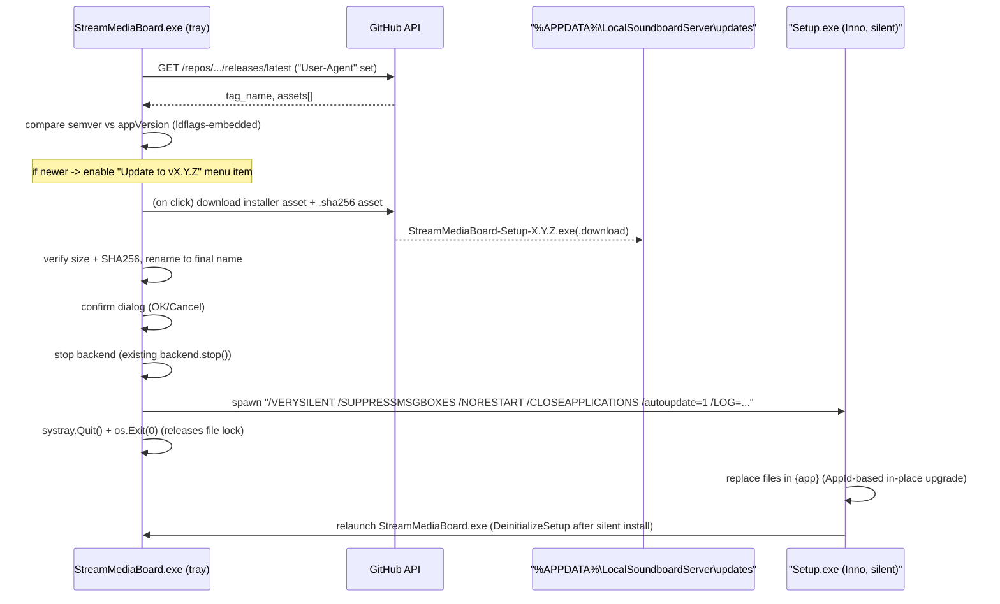

# Auto-update (native Go shell)

The app updates itself using GitHub Releases as the source of truth — no separate update server,
no Node/Electron involvement. All logic lives in the native Go tray shell (`shell/`), so the updater
works independently of the backend's health.

## Files

- [shell/version.go](../shell/version.go) — `appVersion`, embedded at build time via `-ldflags -X`.
- [shell/updater.go](../shell/updater.go) — GitHub polling, semver comparison, download + checksum
  verification, applying the update, state persistence, background scheduler.
- [shell/win32.go](../shell/win32.go) — `confirmBox` (OK/Cancel dialog) and `freeDiskSpaceBytes`
  (disk space check), added alongside the existing `messageBox` helper.
- [shell/config.go](../shell/config.go) — `paths.updatesDir`, `paths.updateStateFile`,
  `paths.isPackaged`, and the `updateRepoOwner`/`updateRepoName`/timing constants.
- [shell/tray.go](../shell/tray.go) — the "Check for Updates" and "Update to vX.Y.Z" tray menu items
  and their click handlers; wires `scheduleUpdateChecks` into `startupBackend`.
- [scripts/stage-windows-dist.mjs](../scripts/stage-windows-dist.mjs) — embeds `package.json`'s
  version into the shell binary via `-ldflags -X main.appVersion=...`.
- [installer/soundboard.iss](../installer/soundboard.iss) — `AppMutex` (Setup's own running-instance
  detection) and the `/autoupdate=1`-gated `[Run]` entry that relaunches the app after a silent install.
- [scripts/publish-release.mjs](../scripts/publish-release.mjs) — computes and uploads a
  `StreamMediaBoard-Setup-X.Y.Z.exe.sha256` asset alongside the installer.

## Architecture

- **Source of truth**: `GET https://api.github.com/repos/mmartinewski/stream-media-board/releases/latest`
  (public repo, unauthenticated — 60 requests/hour/IP, well within the check frequency below).
- **Check**: async, throttled to once per 6h (persisted across restarts in
  `%APPDATA%\LocalSoundboardServer\updates\update-state.json`), plus an initial check 30s after the
  tray becomes ready (never blocks startup). "Check for Updates" in the tray menu bypasses the throttle.
- **Download**: only happens when the user clicks "Update to vX.Y.Z" (installer is ~130-150 MB —
  never downloaded silently in the background).
- **Apply**: confirm dialog → stop backend → spawn the downloaded installer with
  `/VERYSILENT /SUPPRESSMSGBOXES /NORESTART /CLOSEAPPLICATIONS /autoupdate=1 /LOG=...` → shell exits
  (`systray.Quit()` + `os.Exit(0)`) → Inno Setup replaces files in place (same `AppId`) →
  `DeinitializeSetup` relaunches `StreamMediaBoard.exe` after a short pause.
- **Dev-safe**: the whole feature is gated on `paths.isPackaged` (presence of `unins000.exe`, created
  only by Inno Setup). Dev/manual runs of the shell never hit the network for this and show
  "(unavailable in dev)" on the menu item.

## Tray menu

- **Check for Updates** — manual, throttle-bypassing check. Shows a result dialog either way
  (up to date / update found / error). Disabled with "(unavailable in dev)" outside a packaged install.
- **Update to vX.Y.Z** — disabled ("No update available") until a newer release is found (by either
  the background scheduler or a manual check). Clicking it downloads (with a live percentage in the
  item's title), verifies, shows a confirm dialog, then applies the update.

## Failure scenarios and mitigations

- **No network / GitHub unreachable** — 10s timeout on the release-check request; auto-check logs and
  retries next cycle; manual check shows a friendly error dialog. App keeps working either way.
- **GitHub API rate limit (60/h unauthenticated)** — detected via `X-RateLimit-Remaining: 0`; backs off
  until `X-RateLimit-Reset`, persisted as `RateLimitedUntil` in the state file.
- **No releases yet (404)** — treated as "no update", not an error.
- **Release is a draft or prerelease** — skipped (`Draft`/`Prerelease` fields checked explicitly, in
  addition to `/releases/latest` already excluding them on GitHub's side).
- **Release has no matching Windows asset yet** (still uploading) — treated as "no update available".
- **Malformed/unexpected version tag** — `parseSemver` returns `ok=false`; treated as not-newer, logged.
- **Running version already latest or newer** (rollback) — numeric semver comparison, not string compare.
- **Partial/corrupted download** — written to a `.download` temp file first; size checked against
  `Content-Length`; renamed to the final name only after all checks pass.
- **Checksum mismatch** — file deleted, error surfaced, retry available from the tray.
- **Missing checksum asset** (e.g. very first release published before this feature shipped) — logged
  as a warning, install still allowed (checksum is best-effort, not a hard requirement).
- **Insufficient disk space** — checked via `freeDiskSpaceBytes` (requires ~2x the installer size)
  before downloading; clear error message with the required MB.
- **Stale files in the updates cache** — cleaned up before each new download attempt.
- **Antivirus quarantines/blocks the installer** — `exec.Command(...).Start()` error is caught, the
  backend is restarted so the app keeps working, and the error dialog mentions checking AV quarantine
  (mirrors the existing backend-startup error message style).
- **Concurrent update attempts** — guarded by an `updateInProgress` flag under the shell's state mutex.
- **User declines the confirm dialog** — no-op; the tray item stays enabled and reuses the already
  verified download on the next click (no re-download).
- **Dev/unpackaged run** — feature disabled entirely up front (`isPackaged` gate).
- **Corrupted update-state file** — tolerated as a zero-value state; logged.
- **Shell doesn't exit before Setup starts writing files** — mitigated by `AppMutex` (Setup's own
  detection) plus `/CLOSEAPPLICATIONS` (Restart Manager fallback).
- **Silent installer needs to relaunch the app** — the default `[Run]` "Launch" entry is
  `skipifsilent`; `DeinitializeSetup` in `soundboard.iss` relaunches after any successful
  silent install (with a short pause so `AppMutex` is released first). The shell also retries
  mutex acquisition briefly on startup so the post-install relaunch is not rejected as a
  duplicate instance.
- **Backend holds a file lock at update time** — reuses the existing, already-tested `backend.stop()`
  (kill + wait up to 5s) before spawning the installer.
- **Unsigned installer / SmartScreen** — launched via `exec.Command` (`CreateProcess`-style, not
  `ShellExecute`), avoiding the double-click/Explorer prompt path; code signing (`dist:signed`) remains
  recommended for production releases.
- **No post-mortem log for a failed silent install** — `/LOG="<logsDir>\installer-X.Y.Z.log"` is always
  passed to the installer invocation.

## Manual QA checklist

- Build with `npm run installer:inno`; confirm the tray tooltip shows the embedded version
  (`Stream Media Board vX.Y.Z — left-click to open dashboard`).
- Install an older version, bump `package.json`, publish a real (or test) GitHub release with the
  checksum asset, then use "Check for Updates" — confirm it finds the new version.
- Click "Update to vX.Y.Z" → confirm dialog → confirm the app restarts on the new version, tray still
  functional, backend healthy.
- Cancel the confirm dialog → confirm nothing happens and the item stays clickable.
- Disconnect network → "Check for Updates" → confirm a friendly error, no crash, app keeps working.
- Run the dev/unpackaged `shell/StreamMediaBoard.exe` (no installer) → confirm update items are
  disabled and no network call is made.
- Delete/corrupt `%APPDATA%\LocalSoundboardServer\updates\update-state.json` → confirm the app still
  starts and re-creates it.

## Release requirements

See the "Auto-update requirements" section in
[.cursor/skills/release-stream-media-board/SKILL.md](../.cursor/skills/release-stream-media-board/SKILL.md) —
in short: never publish a draft/prerelease for a version meant to reach users, keep the tag as
`vMAJOR.MINOR.PATCH`, and keep the installer asset name as `StreamMediaBoard-Setup-X.Y.Z.exe`
(the checksum asset is generated and uploaded automatically by `publish-release.mjs`).
