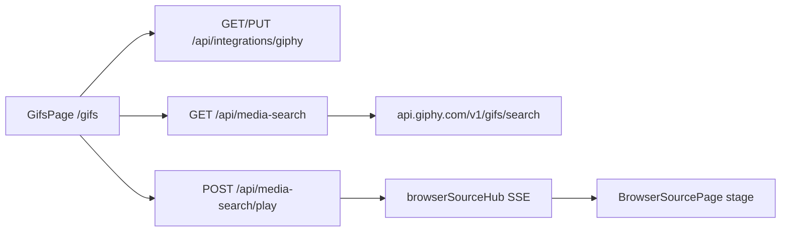
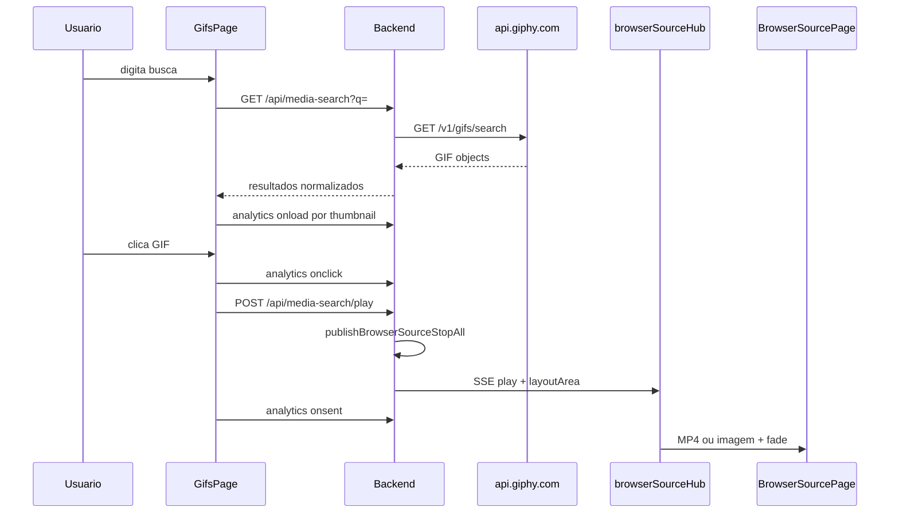

# Busca e play de mídia via GIPHY — Especificação e planejamento

**Status:** **Draft** — feature planejada; não implementada no código atual.  
**Público:** implementadores, revisores e usuários que precisam configurar a integração.  
**Relacionados:** [browser-source-setup.md](./browser-source-setup.md) (overlay OBS), [overlay-layout-stage.md](./overlay-layout-stage.md) (layout areas e `?mode=stage`), [technical-specification.md](./technical-specification.md) (visão geral do app).

---

## 1. Status e escopo

### 1.1 Contexto e motivação

A API pública do **Tenor** (Google) está em descontinuação: novas chaves deixaram de ser emitidas em jan/2026 e o shutdown está previsto para **30/jun/2026**. Para busca de GIFs em tempo real, o **GIPHY** é o provedor MVP desta feature.

O caso de uso: o streamer abre uma tela no app, busca um GIF, clica no resultado e o conteúdo **toca no browser overlay** (`/overlay/browser?mode=stage`) em uma **layout area** pré-configurada — com fade in/out, como os clipes de vídeo locais.

Nomes internos usam prefixo genérico (`media-search`, `provider: giphy`) para permitir outros provedores no futuro sem refatoração ampla.

### 1.2 Decisões confirmadas

| Tópico | Decisão |
| --- | --- |
| **Provedor MVP** | GIPHY (`api.giphy.com/v1/gifs/search`) |
| **Rota da UI** | `/gifs` |
| **Chave API** | Armazenada só no backend (`app_settings`); nunca exposta ao frontend |
| **Play no overlay** | SSE existente via [`browserSourceHub.ts`](../backend/src/services/browserSourceHub.ts) |
| **Formato animado** | MP4 do GIPHY no `<video>` (fim natural via `ended`) |
| **Imagem estática** | `` + timer configurável (`media_search.static_display_seconds`) |
| **Layout area** | Mapeamento global por orientação (como clipes de vídeo); override opcional no play |
| **Atribuição GIPHY** | Logo **Powered by GIPHY** (asset oficial) na **tela de busca** — não no overlay durante play |
| **Analytics** | Pingbacks GIPHY: `onload`, `onclick`, `onsent` |

### 1.3 In scope (MVP)

- Tela `/gifs` com busca, grid de resultados e play imediato ao clicar.
- Seção de configuração na própria tela (setup quando a chave estiver ausente).
- Proxy de busca e play no backend.
- Reprodução no overlay via [`BrowserSourcePage.tsx`](../frontend/src/pages/BrowserSourcePage.tsx) e layout areas.
- Item **GIFs** no menu lateral ([`AppSideMenu.tsx`](../frontend/src/components/AppSideMenu.tsx)).
- Analytics e atribuição conforme termos GIPHY.

### 1.4 Out of scope (v1)

- Trending, autocomplete, stickers e GIPHY Clips (com áudio).
- Busca agregada multi-provedor.
- Salvar GIF como clipe local no SQLite.
- Seletor de layout area por clique (usar área padrão; override fica para v1.1).
- Crédito de criador (`@username`) no overlay.
- Atribuição **Powered by GIPHY** queimada em cada play no OBS.

---

## 2. Como obter a API key do GIPHY

Passo a passo para usuários e desenvolvedores.

### 2.1 Pré-requisitos

- Conta no [GIPHY Developers Dashboard](https://developers.giphy.com/dashboard/).
- Conexão com a internet no PC onde o Stream Media Board roda.

### 2.2 Obter a chave (beta)

1. Acesse **https://developers.giphy.com/dashboard/** e faça login (ou crie uma conta).
2. Clique em **Create an App** (ou equivalente no dashboard).
3. Preencha os dados do app (nome, descrição). Escolha o tipo adequado (API / SDK conforme o formulário).
4. Após criar o app, copie a **API Key** exibida no dashboard (string alfanumérica de ~32 caracteres).
5. Guarde a chave em local seguro. **Não** commite a chave no repositório Git.

### 2.3 Limites da chave beta

- Chaves novas começam como **beta**: tipicamente **~100 requisições/hora** (busca + trending etc.).
- Suficiente para desenvolvimento e testes locais durante a implementação do MVP.
- Para uso intenso em live, solicite **Upgrade to Production** no dashboard quando o MVP estiver estável (ver [§9](#9-conformidade-giphy)).

### 2.4 Configurar a chave no app

1. Suba o app (`npm run dev` ou `npm start`).
2. Abra a tela **GIFs** (`/gifs`) pelo menu lateral.
3. Se a chave ainda não estiver configurada, a tela exibirá o formulário de setup.
4. Cole a API key no campo **API Key** e salve.
5. A chave é persistida no backend em `app_settings` (`integration.giphy.api_key`). O frontend recebe apenas `giphy_api_key_configured: true` — nunca a chave em texto claro.

Para alterar a chave depois, use a seção **Configurar GIPHY** na mesma tela (campo vazio no PUT mantém a chave existente).

### 2.5 Recursos oficiais

| Recurso | URL |
| --- | --- |
| Documentação da API | https://developers.giphy.com/docs/api/ |
| Guia de migração Tenor → GIPHY | https://developers.giphy.com/docs/api/tenor-migration/ |
| Assets de atribuição (logo Powered by GIPHY) | http://giphymedia.s3.amazonaws.com/giphy-attribution-marks.zip |
| Termos de serviço da API | https://support.giphy.com/hc/en-us/articles/360028134111-GIPHY-API-Terms-of-Service |

---

## 3. Configuração no app (settings)

Persistência proposta em `app_settings` (SQLite), chaves namespaced:

| Key | Descrição | Default |
| --- | --- | --- |
| `integration.giphy.api_key` | Chave secreta GIPHY | *(vazio)* |
| `integration.giphy.enabled` | Habilitar busca GIPHY | `1` quando key presente |
| `media_search.static_display_seconds` | Duração de imagem estática (segundos) | `3` |
| `media_search.rating` | Filtro de conteúdo GIPHY (`g`, `pg`, `pg-13`, `r`) | `pg-13` |
| `media_search.customer_id` | ID estável para analytics GIPHY | gerado na 1ª config (UUID ou `/v1/randomid`) |

Layout area no play usa o mesmo **By orientation (global default)** configurado em **Layout areas** (`layout_area_id_landscape` / `layout_area_id_portrait`), não uma area dedicada só para GIPHY.

### 3.1 Regras da API de settings

- **`GET /api/integrations/giphy`:** retorna flags e preferências; **nunca** a API key em claro.
- **`PUT /api/integrations/giphy`:** aceita nova key; campo vazio ou omitido **mantém** a key existente.
- Botão ou ação **Remover chave** (opcional v1.1): apaga `integration.giphy.api_key`.

### 3.2 Layout area (orientação global)

Configure em **Layout areas** ([`/settings/layout-areas`](../frontend/src/pages/LayoutAreasPage.tsx)) o mapeamento **By orientation (global default)** — landscape e portrait — como nos clipes de vídeo. GIFs landscape (incl. quase quadrados) usam `layout_area_id_landscape`; portrait usa `layout_area_id_portrait`.

O browser source deve usar **`?mode=stage`** na resolução do canvas (ex.: 1920×1080). Ver [browser-source-setup.md](./browser-source-setup.md).

---

## 4. Comportamento atual vs alvo

### 4.1 Comportamento atual

| Camada | Comportamento |
| --- | --- |
| **Overlay** | `<video>` e `<audio>`; eventos SSE `play` e `stop`. Sem suporte a URLs externas de GIF ou `mediaKind: image`. |
| **Hub SSE** | [`BrowserSourcePlayEvent`](../backend/src/services/browserSourceHub.ts): `mediaKind` opcional `audio` \| `video`. |
| **Play local** | [`POST /api/clips/:id/play`](../backend/src/routes/play.ts) → arquivos locais em `/api/clips/:id/video`. |
| **Settings** | [`settings.ts`](../backend/src/db/repositories/settings.ts): apenas `playback_volume`. |
| **Menu** | Media Board, Checklists, Layout areas — sem tela de GIFs. |

### 4.2 Comportamento alvo

| Camada | Comportamento |
| --- | --- |
| **Tela `/gifs`** | Busca debounced, grid de thumbnails, config de key, rodapé Powered by GIPHY. |
| **Backend** | Proxy GIPHY search + play + analytics pingbacks. |
| **SSE** | Evento `play` com URL HTTPS do CDN GIPHY, dims, `layoutArea`, opcional `displayDurationSec`. |
| **Overlay** | MP4 animado no `<video>` existente; estático em `` + timer; fade ~400 ms. |

### 4.3 Fluxo de dados





---

## 5. Formatos GIPHY (MVP)

| Uso | Campo na resposta GIPHY | Motivo |
| --- | --- | --- |
| Thumbnail no grid | `images.fixed_width_small.url` | Leve (~100px) |
| Play no overlay (animado) | `images.original.mp4` ou `images.fixed_width.mp4` | Toca **uma vez**; encaixa no `<video>` |
| **Evitar** | `images.looping.mp4` | Loop de 15 segundos |
| Play (estático) | `images.original_still.url` | Fallback quando MP4 indisponível |
| Dimensões | `images.original.width` / `height` (strings → int) | Layout slot no stage |

O overlay já resolve URLs externas HTTPS em [`resolveMediaUrl`](../frontend/src/pages/BrowserSourcePage.tsx).

---

## 6. Protocolo SSE (extensão proposta)

Payload de play estendido (compatível com clipes de vídeo):

```ts
{
  type: 'play',
  mediaKind: 'video' | 'image',
  mediaUrl: 'https://media1.giphy.com/media/.../giphy.mp4',
  volume?: number,
  playbackVolume?: number,
  width?: number,
  height?: number,
  orientation?: 'landscape' | 'portrait',
  layoutArea?: LayoutAreaDto,
  displayDurationSec?: number  // apenas mediaKind === 'image'
}
```

**Resolução de layout area** (espelha clipes de vídeo, sem `default_layout_area_id` por clipe):

1. Body `layout_area_id` se presente e válido (override explícito).
2. Senão **mapeamento global por orientação** em Layout areas (`layout_area_id_landscape` / `layout_area_id_portrait`), derivada das dimensões do GIF.
3. Senão primeira area fullscreen, depois qualquer area seedada, depois fallback do sistema.

Antes de publicar o play: [`publishBrowserSourceStopAll()`](../backend/src/services/browserSourceHub.ts) — mesmo comportamento dos clipes locais.

Filtro de clientes SSE: `?mode=stage` ou `universal` recebem vídeo/GIF; ver [`browserSourceModeAcceptsClip`](../backend/src/services/videoOrientation.ts).

---

## 7. API REST proposta (backend)

Registrar novos routers em [`backend/src/app.ts`](../backend/src/app.ts).

| Método | Rota | Descrição |
| --- | --- | --- |
| `GET` | `/api/integrations/giphy` | Status da config (sem expor key) |
| `PUT` | `/api/integrations/giphy` | Salvar key + preferências (`rating`, layout area, static seconds) |
| `GET` | `/api/media-search?q=&offset=` | Proxy para `GET https://api.giphy.com/v1/gifs/search` |
| `POST` | `/api/media-search/play` | Body: `{ provider: 'giphy', external_id, layout_area_id? }` |
| `POST` | `/api/media-search/analytics` | Body: `{ url, customer_id }` — proxy GET pingback GIPHY |

### 7.1 Resposta normalizada de busca

Independente do provedor (futuro):

```ts
interface MediaSearchResult {
  provider: 'giphy';
  externalId: string;
  title: string;
  previewUrl: string;
  playUrl: string;
  width: number;
  height: number;
  isAnimated: boolean;
  analytics: {
    onload: string;
    onclick: string;
    onsent: string;
  };
}

interface MediaSearchResponse {
  results: MediaSearchResult[];
  pagination: { offset: number; count: number; totalCount: number };
}
```

### 7.2 Resposta de play

```json
{
  "status": "playing",
  "playback": "browser_source",
  "connected_clients": 1
}
```

Erros comuns: `401` key ausente/inválida; `429` rate limit beta; `404` GIF id inexistente.

---

## 8. UI proposta (frontend)

| Elemento | Arquivo / detalhe |
| --- | --- |
| Rota | `/gifs` em [`App.tsx`](../frontend/src/App.tsx) |
| Página | `GifsPage.tsx` (novo) |
| Menu | Item **GIFs** em [`AppSideMenu.tsx`](../frontend/src/components/AppSideMenu.tsx) |
| API client | Métodos em [`api.ts`](../frontend/src/lib/api.ts) |
| Layout visual | Padrão de busca de [`ChecklistsListPage.tsx`](../frontend/src/pages/ChecklistsListPage.tsx) |

### 8.1 Estados da página

1. **Sem API key:** formulário de setup + link para [§2](#2-como-obter-a-api-key-do-giphy).
2. **Com key, busca vazia:** placeholder ou trending (v1.1).
3. **Resultados:** grid de thumbnails; clique dispara play.
4. **Rodapé fixo:** logo **Powered by GIPHY** (asset do zip oficial).

### 8.2 Play e feedback

- Clique → `POST /api/media-search/play`.
- Se `connected_clients === 0`, toast de aviso (mesmo padrão do Media Board / [`useClipCards`](../frontend/src/hooks/useClipCards.ts)).
- Debounce de busca ~300 ms; paginação via `offset`.

---

## 9. Conformidade GIPHY

| Requisito | Implementação MVP |
| --- | --- |
| **Powered by GIPHY** | Logo oficial na tela `/gifs` (não texto puro) |
| **Analytics** | `onload` (thumbnail visível), `onclick` (clique), `onsent` (play) |
| **URLs de mídia** | Não alterar query params das URLs retornadas pela API |
| **Atribuição de conteúdo** | v1: via analytics; crédito `@username` no overlay fica fora do MVP |
| **Proxy backend** | App desktop: proxy esconde a key; incluir `country_code` nas chamadas proxificadas quando aplicável |

### 9.1 Upgrade para production key

Quando solicitar **Upgrade to Production** no dashboard GIPHY:

1. Grave um **vídeo ou screenshot** do fluxo completo: busca com logo Powered by GIPHY → clique → overlay.
2. Anexe na solicitação no dashboard.
3. Confirme que analytics estão implementados.

---

## 10. Fases de implementação

### Phase A — Settings e proxy GIPHY

- [x] Repositório de settings de integração ([`mediaSearchSettings.ts`](../backend/src/db/repositories/mediaSearchSettings.ts)).
- [x] `GET` / `PUT` `/api/integrations/giphy`.
- [x] `GET` `/api/media-search` — proxy search + normalização de resultados.
- [x] Gerar/persistir `customer_id` na primeira config.
- [ ] Teste manual: busca com key válida retorna grid normalizado.

### Phase B — Play no overlay

- [x] `POST` `/api/media-search/play` — resolve GIF by id, monta SSE, `layoutArea`.
- [x] Estender `BrowserSourcePlayEvent` com `mediaKind: 'image'` e `displayDurationSec`.
- [x] [`BrowserSourcePage.tsx`](../frontend/src/pages/BrowserSourcePage.tsx): ramo `image` com `` + timer + fade.
- [x] Ramo MP4 reutiliza `playVideoClip` sem mudanças estruturais grandes.
- [ ] Teste manual: GIF toca na layout area e desaparece ao fim.

### Phase C — UI `/gifs`

- [ ] `GifsPage.tsx` — busca, grid, config, attribution.
- [ ] `POST` `/api/media-search/analytics` + chamadas do frontend.
- [ ] Rota e item de menu lateral.
- [ ] Teste manual: fluxo completo usuário → OBS.

### Phase D — Polish e documentação

- [ ] Link no [`README.md`](../README.md).
- [ ] Troubleshooting (429, overlay desconectado, fallback still).
- [ ] Checklist production key GIPHY.
- [ ] Atualizar release notes quando a feature for lançada.

---

## 11. Testes manuais (checklist)

- [ ] Salvar API key → resposta indica `giphy_api_key_configured: true`.
- [ ] Buscar termo → grid com thumbnails e logo Powered by GIPHY visível.
- [ ] Browser source `?mode=stage` conectado → clique toca GIF na layout area correta.
- [ ] GIF animado (MP4) termina e faz fade out (~400 ms).
- [ ] Conteúdo estático respeita `media_search.static_display_seconds`.
- [ ] Clip de vídeo local continua funcionando após play de GIF.
- [ ] Stop global (`POST /api/clips/stop` ou botão na toolbar) interrompe GIF no overlay.
- [ ] Analytics: verificar pingbacks no network tab (200 OK do GIPHY analytics).

---

## 12. Riscos e mitigações

| Risco | Mitigação |
| --- | --- |
| Rate limit beta (~100/h) | Documentar limite; cache TTL curto no backend (opcional Phase D) |
| OBS sem client `stage` | Toast warning com link para overlay URL |
| MP4 indisponível no objeto GIPHY | Fallback `original_still` + timer |
| Production key rejeitada | Screenshot/vídeo com attribution na UI de busca |
| Proxy vs preferência client-side GIPHY | Documentar exceção para app desktop; considerar revisão na solicitação production |

---

## 13. Evolução futura (pós-MVP)

- Segundo provedor (ex.: Klipy) com mesma interface `MediaSearchResult`.
- Página `/settings/integrations` com cards por provedor.
- Trending e autocomplete GIPHY.
- Seletor de layout area por clique no grid.
- Salvar GIF favorito como clipe local.
- Crédito de criador no overlay (toggle nas settings).

---

## 14. Referências de código existente

| Concern | Arquivo |
| --- | --- |
| SSE hub | [`backend/src/services/browserSourceHub.ts`](../backend/src/services/browserSourceHub.ts) |
| Play clip local | [`backend/src/routes/play.ts`](../backend/src/routes/play.ts) |
| Layout area resolve | [`backend/src/services/layoutAreaResolve.ts`](../backend/src/services/layoutAreaResolve.ts) |
| Overlay player | [`frontend/src/pages/BrowserSourcePage.tsx`](../frontend/src/pages/BrowserSourcePage.tsx) |
| Layout slot CSS | [`frontend/src/lib/layoutSlot.ts`](../frontend/src/lib/layoutSlot.ts) |
| App settings | [`backend/src/db/repositories/settings.ts`](../backend/src/db/repositories/settings.ts) |
| Menu lateral | [`frontend/src/components/AppSideMenu.tsx`](../frontend/src/components/AppSideMenu.tsx) |
