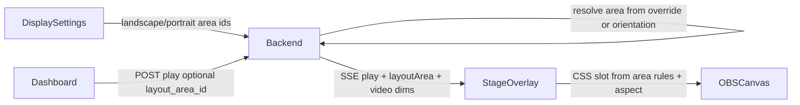

# Overlay Layout Stage — Technical Specification

**Status:** **v0.8.0+** — Layout Stage shipped through Phase D (stage mode, areas CRUD, visual editor, per-clip default area).  
**Audience:** Implementers and reviewers.  
**Related:** [browser-source-setup.md](./browser-source-setup.md) (current OBS workflow), [technical-specification.md](./technical-specification.md) (v1 app overview), [todo-lists-overlay.md](./todo-lists-overlay.md) (planned to-do lists on the same stage overlay).

---

## 1. Status and scope

### 1.1 Status

This document describes a **planned** feature set. The running app today uses orientation-based browser source modes (`landscape`, `portrait`, `universal`, `audio`) and full-bleed video inside each source. See [§2 Problem statement](#2-problem-statement) for the delta.

### 1.2 In scope

- **Video layout** on a single transparent browser overlay page (the “stage”).
- **Registerable layout areas** with **user-defined names** (anchor, margins, max dimensions); names appear in the dashboard dropdown and display settings.
- **Runtime video slot** sized from each clip’s aspect ratio, clamped to area maxima.
- **Dashboard** dropdown to choose which area applies when a video clip is played (override).
- **Display settings:** global mapping of **landscape** and **portrait** clip orientations to layout areas (replaces OBS routing by orientation).
- **Visual configuration UI** to create and edit layout areas and orientation defaults.
- **Audio clips** unchanged: invisible `<audio>` element, same SSE pipeline; layout areas do not apply to audio.

### 1.3 Out of scope (v1 of this feature)

- **Multiple simultaneous videos** in different areas on the same stage (today: global `stop` before each `play`).
- **Arbitrary anchor position** at custom % X/Y via drag (future editor enhancement); v1 uses the 9-point grid only.
- **Replacing** legacy `?mode=landscape` / `?mode=portrait` OBS sources in the same release (they remain until a later deprecation).

---

## 2. Problem statement

### 2.1 Current behavior

| Layer | Behavior |
| --- | --- |
| **OBS** | Streamers add **multiple** Browser Sources, each with a different `?mode=` and often different **position/size** on the canvas (e.g. portrait box top-right, landscape full width). |
| **Overlay page** | [`frontend/src/index.css`](../frontend/src/index.css): `.browser-source-stage` is `inset: 0`; `.browser-source-video` is `width/height: 100%` with `object-fit: cover` (fills the browser source rectangle, may crop). |
| **Routing** | [`backend/src/services/videoOrientation.ts`](../backend/src/services/videoOrientation.ts): `browserSourceModeAcceptsClip` filters SSE `play` events by `mode` and clip `orientation`. |
| **Play payload** | [`backend/src/routes/play.ts`](../backend/src/routes/play.ts): video events include `mediaUrl`, `width`, `height`, `orientation`, `volume`, `playbackVolume`. |
| **Overlay player** | [`frontend/src/pages/BrowserSourcePage.tsx`](../frontend/src/pages/BrowserSourcePage.tsx): waits for video metadata, then fades in full-bleed video. |

Setup guide for the current model: [browser-source-setup.md](./browser-source-setup.md).

### 2.2 Target behavior

| Layer | Behavior |
| --- | --- |
| **OBS** | **One** Browser Source at **output resolution** (e.g. 1920×1080), URL `.../overlay/browser?mode=stage`. No per-clip positioning in OBS. |
| **Overlay page** | Transparent **stage** (100% × 100%). Each play creates a **video slot**: a positioned box whose size follows the clip aspect ratio within **max width/height %** defined by the selected **layout area**. |
| **Routing** | `?mode=stage` receives all video clips (and optionally audio). Clip `video_orientation` no longer picks OBS sources; it selects the **default layout area** via global display settings (see [§4.5](#45-orientation--layout-area-mapping)). |
| **Dashboard** | Dropdown on each video card lists layout areas; pre-selected from orientation mapping unless overridden; play may send explicit `layout_area_id`. |

### 2.3 Data flow (target)



---

## 3. Core concepts

| Concept | Definition |
| --- | --- |
| **Stage** | The full browser source viewport. All layout math uses a **percentage coordinate system** (0–100% of stage width and height). The stage should match the OBS Browser Source width/height (typically the stream canvas). |
| **Layout area** | A **named, persisted preset** defining how a video slot is anchored and constrained: vertical/horizontal anchor, margins (%), maximum width/height (%), and optional fullscreen mode. |
| **Video slot** | The **runtime** absolutely positioned box that wraps the `<video>` element for one play. Its pixel size is derived from the clip’s aspect ratio and the area’s maxima—not from fixed width/height in the area definition. |
| **Margin** | **External** inset between the stage edge and the video slot, expressed as **% of stage** (top, right, bottom, left). User-facing terminology is **margin**, not padding (padding implies space inside a container). |
| **Anchor** | Which point of the video slot is **fixed** to the stage after margins are applied; the slot grows in the opposite directions. See [§5 Anchor options](#5-anchor-options). |
| **Orientation mapping** | Global display setting: which layout area to use when a clip’s stored orientation is `landscape` or `portrait`. See [§4.5](#45-orientation--layout-area-mapping). |

---

## 4. Layout area data model

### 4.1 Storage

Use a dedicated SQLite table `layout_areas` (not JSON in `app_settings`) to support CRUD, foreign keys, and dashboard dropdown lists.

Proposed migration (additive):

```sql
CREATE TABLE IF NOT EXISTS layout_areas (
    id INTEGER PRIMARY KEY AUTOINCREMENT,
    name TEXT NOT NULL UNIQUE,
    sort_order INTEGER NOT NULL DEFAULT 0,
    anchor_vertical TEXT NOT NULL CHECK (anchor_vertical IN ('top', 'middle', 'bottom')),
    anchor_horizontal TEXT NOT NULL CHECK (anchor_horizontal IN ('left', 'center', 'right')),
    margin_top REAL NOT NULL DEFAULT 0,
    margin_right REAL NOT NULL DEFAULT 0,
    margin_bottom REAL NOT NULL DEFAULT 0,
    margin_left REAL NOT NULL DEFAULT 0,
    max_width_percent REAL NOT NULL DEFAULT 100,
    max_height_percent REAL NOT NULL DEFAULT 100,
    is_fullscreen INTEGER NOT NULL DEFAULT 0,
    created_at TIMESTAMP DEFAULT CURRENT_TIMESTAMP
);
```

Optional later column on `clips`:

```sql
-- Phase D
ALTER TABLE clips ADD COLUMN default_layout_area_id INTEGER
    REFERENCES layout_areas(id) ON DELETE SET NULL;
```

### 4.2 Field semantics

| Field | Range | Meaning |
| --- | --- | --- |
| `name` | unique string | **User-defined display name** for the area (required on create; editable on update). Shown in dashboard dropdown, orientation mapping selects, and layout editor list. Not derived from anchor or orientation. |
| `sort_order` | integer | Display order in lists (lower first). |
| `anchor_vertical` | `top` \| `middle` \| `bottom` | Vertical anchor of the slot. |
| `anchor_horizontal` | `left` \| `center` \| `right` | Horizontal anchor of the slot. |
| `margin_*` | 0–100 | % of **stage** height (top/bottom) or width (left/right). |
| `max_width_percent` | 0–100 | **Maximum** slot width as % of stage width—not a fixed width. |
| `max_height_percent` | 0–100 | **Maximum** slot height as % of stage height—not a fixed height. |
| `is_fullscreen` | 0 or 1 | When `1`: treat as full stage (maxima 100/100; see [§6.4 Fullscreen](#64-fullscreen-areas)). |

### 4.3 Seed data (first install / migration)

Suggested default areas (names illustrative):

| name | anchor | margins (T/R/B/L %) | max W × H % | fullscreen |
| --- | --- | --- | --- | --- |
| Top right | top + right | 5 / 5 / 0 / 0 | 35 × 45 | 0 |
| Center | middle + center | 0 / 0 / 0 / 0 | 80 × 80 | 0 |
| Fullscreen | middle + center | 0 / 0 / 0 / 0 | 100 × 100 | 1 |

Implementers may tune seed maxima; the important part is demonstrating corner vs center vs fullscreen.

### 4.4 JSON representation (API)

Example object returned by `GET /api/layout-areas`:

```json
{
  "id": 1,
  "name": "Top right",
  "sort_order": 10,
  "anchor_vertical": "top",
  "anchor_horizontal": "right",
  "margin_top": 5,
  "margin_right": 5,
  "margin_bottom": 0,
  "margin_left": 0,
  "max_width_percent": 35,
  "max_height_percent": 45,
  "is_fullscreen": 0,
  "created_at": "2026-05-30T12:00:00.000Z"
}
```

### 4.5 Orientation → layout area mapping

In the **display / layout areas settings** screen, the user assigns which registered layout area applies to each clip orientation. This replaces the today’s OBS pattern of separate browser sources for `?mode=landscape` and `?mode=portrait`: one `?mode=stage` source handles both; the app picks the area from clip metadata and global settings.

#### 4.5.1 Storage

Store in `app_settings` (alongside `playback_volume`) or expose via a dedicated `layout_settings` aggregate API:

| Key | Type | Meaning |
| --- | --- | --- |
| `layout_area_id_landscape` | integer (FK) | Default area when clip `video_orientation` is `landscape` |
| `layout_area_id_portrait` | integer (FK) | Default area when clip `video_orientation` is `portrait` |

Values are IDs from `layout_areas.id`. On delete of a referenced area, set the corresponding key to NULL and fall back per [§7.2](#72-play-clip-extend-existing).

Optional later (not v1): `layout_area_id_fullscreen` if clips gain an explicit fullscreen layout mode separate from orientation.

#### 4.5.2 Seed defaults (migration)

After seeding layout areas (see [§4.3](#43-seed-data-first-install--migration)), set for example:

| Setting | Suggested area |
| --- | --- |
| `layout_area_id_landscape` | Top right (PiP-style) or Fullscreen — product choice |
| `layout_area_id_portrait` | Top right |

Implementers should document chosen seeds in release notes.

#### 4.5.3 How orientation is determined at play time

Use the clip’s stored `video_orientation` from the database ([`clips.video_orientation`](../backend/src/db/schema.sql)), resolved the same way as today:

- Set in the clip editor when saving a video clip.
- Backfilled from MP4 dimensions via ffprobe when missing ([`videoClipMetadata.ts`](../backend/src/services/videoClipMetadata.ts)).
- **Square / near-square (1:1)** videos: treated as **`landscape`** ([`deriveVideoOrientation`](../backend/src/services/videoOrientation.ts)); they use the landscape mapping unless the user overrides on the dashboard.

If orientation is missing or invalid at play time, treat as **`landscape`** for mapping purposes.

#### 4.5.4 Relationship to other defaults

| Mechanism | Scope | When it applies |
| --- | --- | --- |
| **Orientation mapping** | Global display settings | Automatic default for every video play |
| **Dashboard dropdown** | Per click | Streamer override for this play only |
| **`clips.default_layout_area_id`** | Per clip (Phase D) | Overrides orientation mapping for that clip |
| **Explicit `layout_area_id` in play body** | Per request | Highest priority |

See [§7.2](#72-play-clip-extend-existing) for the full resolution order.

#### 4.5.5 Example

| Display setting | Area | Typical use |
| --- | --- | --- |
| Landscape → “Top right” | anchor top-right, max 35×45% | Wide reactions, memes |
| Portrait → “Top right” | same area definition | Tall clips; slot shape differs by aspect |
| Landscape → “Fullscreen” | `is_fullscreen` | Highlights (if user maps landscape only) |

Portrait and landscape may point to the **same** area id (one PiP corner) or **different** areas (e.g. portrait top-right, landscape fullscreen).

---

## 5. Anchor options

Anchors are **two-dimensional**: one vertical and one horizontal value. Together they form a **3×3 grid** (nine combinations).

### 5.1 Enums (recommended API)

- `anchor_vertical`: `top` | `middle` | `bottom`
- `anchor_horizontal`: `left` | `center` | `right`

Composite label for docs/UI: `{vertical}-{horizontal}` (e.g. `top-right`).

### 5.2 Nine anchors

| anchor_vertical | anchor_horizontal | Label | Slot growth direction |
| --- | --- | --- | --- |
| top | left | Top left | Down and right |
| top | center | Top center | Down; horizontal symmetric |
| top | right | Top right | Down and left |
| middle | left | Middle left | Vertical symmetric; right |
| middle | center | **Center** | Symmetric in all directions |
| middle | right | Middle right | Vertical symmetric; left |
| bottom | left | Bottom left | Up and right |
| bottom | center | Bottom center | Up; horizontal symmetric |
| bottom | right | Bottom right | Up and left |

### 5.3 UI shortcuts

| Shortcut | Maps to | Use case |
| --- | --- | --- |
| **Center** | `middle` + `center` | Reactions, highlights in the middle of the canvas |
| **Fullscreen** | `is_fullscreen = 1` (see below) | Not the same as center with small maxima |

### 5.4 Margins per anchor

All four margins are stored; typically only sides adjacent to the anchor edges are non-zero:

| Anchor | Margins usually set |
| --- | --- |
| top-left | `margin_top`, `margin_left` |
| top-right | `margin_top`, `margin_right` |
| bottom-left | `margin_bottom`, `margin_left` |
| bottom-right | `margin_bottom`, `margin_right` |
| top-center | `margin_top` |
| bottom-center | `margin_bottom` |
| middle-left | `margin_left` |
| middle-right | `margin_right` |
| middle-center | Often all zero |

### 5.5 CSS positioning (implementation reference)

For a slot with computed pixel size `(slotW, slotH)` inside stage `(stageW, stageH)`:

| Anchor | Positioning strategy |
| --- | --- |
| top + left | `top: marginTop`, `left: marginLeft` |
| top + right | `top: marginTop`, `right: marginRight` |
| top + center | `top: marginTop`, `left: 50%`, `transform: translateX(-50%)` |
| bottom + * | `bottom: marginBottom` (+ left/right/center as above) |
| middle + left | `top: 50%`, `left: marginLeft`, `transform: translateY(-50%)` |
| middle + right | `top: 50%`, `right: marginRight`, `transform: translateY(-50%)` |
| middle + center | `left: 50%`, `top: 50%`, `transform: translate(-50%, -50%)` |

Margins convert to pixels: `marginTopPx = stageH * margin_top / 100`, etc.

---

## 6. Sizing algorithm

### 6.1 Principles

1. **Max dimensions are ceilings**, not fixed slot sizes.
2. **Aspect ratio** comes from the clip (`video_width` / `video_height` on the play event, confirmed by `HTMLVideoElement.videoWidth` / `videoHeight` after metadata).
3. **Native pixel dimensions** of the file are **not** used as CSS pixel sizes on the stage (a 720×1280 file does not render as 720×1280 px unless that happens to fit the computed slot).

### 6.2 Fit-within-max (normative)

**Inputs:**

- `stageW`, `stageH` — browser source client size (e.g. `window.innerWidth`, `innerHeight`)
- `max_width_percent`, `max_height_percent` from layout area
- `videoW`, `videoH` — intrinsic dimensions (must be > 0)

**Steps:**

```
maxW = stageW * max_width_percent / 100
maxH = stageH * max_height_percent / 100
aspect = videoW / videoH

// Fit box inside (maxW, maxH) preserving aspect
slotH = maxH
slotW = slotH * aspect
if slotW > maxW:
    slotW = maxW
    slotH = slotW / aspect

// slotW, slotH are the video slot size in pixels
```

Then apply anchor + margin rules from [§5.5](#55-css-positioning-implementation-reference) to place the slot.

### 6.3 Video element inside slot

The slot `div` gets explicit `width` and `height` in pixels (or % derived once from the above). The `<video>` fills the slot:

```css
.video-slot video {
  display: block;
  width: 100%;
  height: 100%;
  object-fit: fill; /* safe when slot aspect matches video aspect */
}
```

Optional: `object-fit: contain` if implementers want letterboxing inside the slot (usually unnecessary if slot aspect matches video).

### 6.4 Fullscreen areas

When `is_fullscreen === 1`:

- `max_width_percent` and `max_height_percent` should be **100** (enforce on save).
- Slot should cover the full stage inside margins (typically zero margins).
- **`object-fit: cover`** on the video may be used to fill the stage without letterboxing (matches current full-bleed behavior). Document this as a product choice: fullscreen = cinematic fill; corner areas = exact aspect within max box.

### 6.5 Edge cases

| Case | Behavior |
| --- | --- |
| Invalid / zero `videoW` or `videoH` | Fallback aspect **16:9**; log in dev |
| `layout_area_id` missing on play | Resolve per [§7.2](#72-play-clip-extend-existing) (orientation mapping, clip default, fallbacks) |
| Orientation mapping unset (NULL area id) | Skip that step; use next resolver step |
| Area deleted while referenced | Clear `app_settings` FK keys and clip `default_layout_area_id`; dashboard + settings UI refresh |
| Stage resized (OBS property change) | Recompute slot on next play or `resize` listener (optional v1.1) |

### 6.6 Timing relative to fade-in

Today the overlay waits for `loadedmetadata` before showing video ([`BrowserSourcePage.tsx`](../frontend/src/pages/BrowserSourcePage.tsx)). **Recommended:** compute slot dimensions from SSE `width`/`height` for the first layout frame, then refine after metadata if dimensions differ.

---

## 7. API (proposed)

### 7.1 Layout areas CRUD

| Method | Route | Description |
| --- | --- | --- |
| `GET` | `/api/layout-areas` | List all areas, sorted by `sort_order` then `name` |
| `GET` | `/api/layout-areas/:id` | Single area (editor) |
| `POST` | `/api/layout-areas` | Create; body = area fields (see [§4.4](#44-json-representation-api)) |
| `PUT` | `/api/layout-areas/:id` | Update |
| `DELETE` | `/api/layout-areas/:id` | Delete; set `clips.default_layout_area_id` to NULL where referenced; clear `layout_area_id_landscape` / `layout_area_id_portrait` in `app_settings` if they pointed at this id |

Validation rules:

- Margins and maxima in **0–100**.
- **`name`:** required on create and update; trim whitespace; non-empty after trim; **unique** case-insensitive recommended (`Top Right` vs `top right`); sensible max length (e.g. 80 characters); reject control characters.
- If `is_fullscreen === 1`, force maxima to 100 (or reject inconsistent values).

**Create / update body** must include `name` (along with layout fields). Example:

```json
{
  "name": "PiP top right",
  "anchor_vertical": "top",
  "anchor_horizontal": "right",
  "margin_top": 5,
  "margin_right": 5,
  "margin_bottom": 0,
  "margin_left": 0,
  "max_width_percent": 35,
  "max_height_percent": 45,
  "is_fullscreen": 0,
  "sort_order": 10
}
```

Renaming an area updates the label everywhere immediately (dashboard, display settings, stored FKs reference `id` only).

### 7.2 Play clip (extend existing)

**Current:** `POST /api/clips/:id/play` — no body required.

**Proposed body (optional JSON):**

```json
{
  "layout_area_id": 1
}
```

**Resolution order** (first match wins):

1. Body `layout_area_id` if present and valid (dashboard override or API client).
2. Else clip `default_layout_area_id` if set (Phase D).
3. Else **orientation mapping** from display settings:
   - If `video_orientation === 'portrait'` → `layout_area_id_portrait`
   - Else → `layout_area_id_landscape` (includes square/1:1 and unknown orientation)
4. Else first seed area named “Fullscreen”, or any valid seeded area.
5. Else **system fallback area** (built-in fullscreen; not in DB).

Backend pseudocode:

```
function resolveLayoutAreaId(clip, body): number | null {
  if (body.layout_area_id valid) return body.layout_area_id
  if (clip.default_layout_area_id) return clip.default_layout_area_id
  const o = resolveClipVideoOrientation(clip.video_orientation, clip.video_width, clip.video_height)
  const settings = getLayoutDisplaySettings()
  if (o === 'portrait' && settings.layout_area_id_portrait) return settings.layout_area_id_portrait
  if (settings.layout_area_id_landscape) return settings.layout_area_id_landscape
  const dbFallback = getFirstLayoutAreaId() ?? getSeedFullscreenAreaId()
  if (dbFallback) return dbFallback
  return SYSTEM_FALLBACK_LAYOUT_AREA.id // virtual; overlay uses embedded snapshot
}
```

Audio clips: skip layout resolution; no `layoutArea` on SSE event.

### 7.3 Layout display settings API

Aggregate read/write for orientation mapping (and optionally co-locate with existing settings):

| Method | Route | Description |
| --- | --- | --- |
| `GET` | `/api/layout-settings` | Returns orientation → area mapping + area summaries for dropdowns |
| `PUT` | `/api/layout-settings` | Updates mapping keys |

**Example `GET /api/layout-settings` response:**

```json
{
  "layout_area_id_landscape": 1,
  "layout_area_id_portrait": 1,
  "areas": [
    { "id": 1, "name": "Top right" },
    { "id": 2, "name": "Fullscreen" }
  ]
}
```

**Example `PUT` body:**

```json
{
  "layout_area_id_landscape": 2,
  "layout_area_id_portrait": 1
}
```

Validation: each id must exist in `layout_areas` or be `null` to clear. Reject references to deleted areas on save.

Alternative: extend `GET/PUT /api/settings` with the same fields if the team prefers a single settings endpoint.

### 7.4 SSE play event (extend)

Extend [`BrowserSourcePlayEvent`](../backend/src/services/browserSourceHub.ts):

```typescript
interface BrowserSourcePlayEvent {
  type: 'play';
  mediaUrl: string;
  mediaKind?: 'audio' | 'video';
  volume?: number;
  playbackVolume?: number;
  width?: number;
  height?: number;
  orientation?: 'landscape' | 'portrait';
  layoutArea?: LayoutAreaDto;  // embedded snapshot (recommended)
  // alternative: layout_area_id only; overlay GETs /api/layout-areas on connect
}
```

Embedding the full area on each play avoids a race if the user edits areas while a clip is queued. Audio play events omit `layoutArea`.

### 7.5 Browser source mode: `stage`

Add `stage` to `BrowserSourceMode` in [`videoOrientation.ts`](../backend/src/services/videoOrientation.ts):

```typescript
export type BrowserSourceMode =
  | 'universal'
  | 'audio'
  | 'landscape'
  | 'portrait'
  | 'stage';
```

`browserSourceModeAcceptsClip` for `stage`:

- `mediaKind === 'audio'` → accept (same as universal)
- `mediaKind === 'video'` → accept (no orientation filter)

Overlay URL:

```text
http://localhost:3847/overlay/browser?mode=stage
```

Legacy modes remain for backward compatibility.

### 7.6 Status endpoint (extend)

[`GET /api/browser-source/status`](../backend/src/routes/browserSource.ts) should include:

```json
{
  "overlay_paths": {
    "stage": "/overlay/browser?mode=stage",
    ...
  }
}
```

---

## 8. Dashboard UX

### 8.1 Layout area dropdown (video clips)

- On each **video** card (or in the ⋮ menu): `<select>` populated from `GET /api/layout-areas`; each `<option>` displays the area **`name`** (value = `id`).
- **Initial selection** when the card loads or before play:
  1. Clip `default_layout_area_id` if set (Phase D), else
  2. Area from **orientation mapping** (`layout_area_id_landscape` or `layout_area_id_portrait` based on clip `video_orientation`), else
  3. Fallback area.
- **Play** sends `layout_area_id` with the **current** dropdown value (explicit override even when it matches the default).
- **Audio** cards: hide the selector (layout N/A).

### 8.2 Session persistence (optional)

`localStorage` may remember the **last manually changed** area id for quick overrides. It must **not** replace orientation mapping as the default when opening a card (otherwise portrait clips would keep playing in the last landscape override). Recommended: only persist when the user changes the dropdown away from the orientation-derived default.

### 8.2.1 Orientation label on card (optional UX)

Show a small hint on video cards, e.g. `Portrait → Top right`, so streamers see which mapping applies before overriding.

### 8.3 Default per clip (Phase D)

Clip metadata editor adds optional **Default layout area**; dashboard pre-selects it when opening the card.

### 8.4 Link to configuration

Header or settings link: **Layout areas** → `/layout-areas` (or `/settings/layout-areas`).

---

## 9. Visual configuration UI (proposed)

### 9.1 Route

- Path: `/layout-areas` (preferred) or `/settings/layout-areas`
- Register in [`frontend/src/App.tsx`](../frontend/src/App.tsx)
- Nav link in [`frontend/src/AppShell.tsx`](../frontend/src/AppShell.tsx)

### 9.2 Features

| Feature | Description |
| --- | --- |
| **Area name** | Required text field when creating or editing an area (`name`). Primary label in the areas list; user chooses any label (e.g. `PiP top right`, `Fullscreen reactions`, `Lower third`). |
| List | All areas showing **name** + optional summary (anchor, max %); edit/delete; drag or numeric `sort_order` |
| Create area | **New area** flow: prompt for name first (or name field at top of form), then anchor/margins/maxima |
| Canvas preview | 16:9 box representing the stage; safe area guides optional |
| 3×3 anchor picker | Sets `anchor_vertical` + `anchor_horizontal` |
| Margin sliders | Top/right/bottom/left % with “uniform margin” shortcut |
| Max size sliders | `max_width_percent`, `max_height_percent` |
| Fullscreen toggle | Sets `is_fullscreen` |
| Aspect previews | Overlay ghost rectangles for 16:9 and 9:16 inside the computed slot |
| **Default areas by orientation** | Section **Display defaults** (or **Orientation mapping**): two dropdowns — **Landscape clips** → layout area, **Portrait clips** → layout area — options labeled by area **name**. Saved via `PUT /api/layout-settings`. |
| Mapping preview | On the 16:9 stage preview, show ghost slots for both orientations using the currently selected mapping (16:9 silhouette for landscape, 9:16 for portrait) |

### 9.3 Validation feedback

Live preview runs the same algorithm as [§6](#6-sizing-algorithm) using preview dimensions and sample aspects.

---

## 10. Overlay player changes (implementation map)

| Layer | File | Change |
| --- | --- | --- |
| Layout math | `frontend/src/lib/layoutSlot.ts` (new) | `computeVideoSlot(stage, area, videoW, videoH)` → pixel rect + CSS |
| Overlay page | [`frontend/src/pages/BrowserSourcePage.tsx`](../frontend/src/pages/BrowserSourcePage.tsx) | Wrap video in positioned slot; apply `layoutArea` from SSE |
| Styles | [`frontend/src/index.css`](../frontend/src/index.css) | `.browser-source-stage`, `.video-slot`; remove full-bleed default for `mode=stage` |
| API client | [`frontend/src/lib/api.ts`](../frontend/src/lib/api.ts) | CRUD + `playClip(id, { layout_area_id })` |
| Dashboard | [`frontend/src/pages/DashboardPage.tsx`](../frontend/src/pages/DashboardPage.tsx) | Area dropdown on video cards |
| Editor UI | `frontend/src/pages/LayoutAreasPage.tsx` (new) | Visual config |
| DB | [`backend/src/db/schema.sql`](../backend/src/db/schema.sql), [`migrate.ts`](../backend/src/db/migrate.ts) | `layout_areas` table |
| Repository | `backend/src/db/repositories/layoutAreas.ts` (new) | CRUD |
| Routes | `backend/src/routes/layoutAreas.ts` (new), `layoutSettings.ts` (new), [`app.ts`](../backend/src/app.ts) | Mount `/api/layout-areas`, `/api/layout-settings` |
| Settings repo | `backend/src/db/repositories/settings.ts` (extend) | `layout_area_id_landscape`, `layout_area_id_portrait` keys |
| Play | [`backend/src/routes/play.ts`](../backend/src/routes/play.ts) | Resolve area per §7.2; attach to SSE |
| Hub types | [`backend/src/services/browserSourceHub.ts`](../backend/src/services/browserSourceHub.ts) | `layoutArea` on play event |
| Mode parsing | [`frontend/src/lib/videoOrientation.ts`](../frontend/src/lib/videoOrientation.ts), backend mirror | `stage` mode |

---

## 11. OBS setup (target)

### 11.1 Recommended (after implementation)

1. Add **one** Browser Source.
2. URL: `http://localhost:3847/overlay/browser?mode=stage` (or dev port 5173).
3. **Width** / **Height**: match stream output (e.g. **1920 × 1080**).
4. Transparent background; enable **Refresh browser when scene becomes active** if needed.
5. Position the source **full canvas** in OBS (0,0 — streamers no longer resize per clip type).

Optional second source: `?mode=audio` only if you want soundboard audio isolated from the stage page (otherwise `stage` plays audio too).

### 11.2 Legacy multi-mode setup

Until deprecation, the workflow in [browser-source-setup.md](./browser-source-setup.md) (separate `landscape` / `portrait` / `audio` sources with manual OBS transforms) remains valid.

---

## 12. Empty states and connectivity

Two independent failure modes must be handled explicitly: **no layout areas** (configuration) and **no browser source clients** (OBS / SSE connectivity). They can occur together or separately.

### 12.1 No layout areas registered

**Goal:** Never leave the streamer with a video play that cannot be laid out; prefer prevention over silent breakage.

#### Prevention (primary)

| Rule | Behavior |
| --- | --- |
| **Migration seeds** | First install always inserts at least the seed areas from [§4.3](#43-seed-data-first-install--migration) and sets orientation mapping keys to valid ids. A normal database is **never empty**. |
| **Delete last area** | `DELETE /api/layout-areas/:id` returns **409** if it would remove the **last remaining** row. Message: e.g. “At least one layout area is required.” |
| **Delete area in use** | Allowed if other areas remain; clear FKs on mapping and clips as in [§7.1](#71-layout-areas-crud). |

#### System fallback area (safety net)

If `layout_areas` is empty (manual DB edit, failed migration, or future bug), play must still work:

- Backend exposes a **built-in fallback** layout (not stored in SQLite), equivalent to seed **Fullscreen**:
  - `name`: `"Fullscreen (system default)"` (for logs/UI only)
  - `is_fullscreen`: 1, maxima 100/100, anchor middle+center, margins 0
- `resolveLayoutAreaId` returns this when no DB row matches after step 4 in [§7.2](#72-play-clip-extend-existing).
- SSE embeds this snapshot as `layoutArea` so the overlay does not need a separate code path.

Implement as a constant in backend + frontend (`layoutSlot.ts`), not a user-editable row.

#### Dashboard when `GET /api/layout-areas` returns `[]`

Should not happen after migration; if it does:

- Show a **persistent banner**: “No layout areas — restore defaults or create an area.”
- Video **Play** still allowed (uses system fallback); optional **strict mode** (config flag) could disable play until at least one area exists — **not recommended for v1**.
- Link to **Layout areas** settings to create or restore seeds (`POST /api/layout-areas/restore-defaults` optional convenience endpoint).

#### Orientation mapping with invalid or NULL ids

If `layout_area_id_landscape` / `layout_area_id_portrait` point to missing rows:

- Treat as **unset** for that orientation; continue resolution (clip default → other orientation key → first DB area → system fallback).
- `GET /api/layout-settings` may include `warnings: ["portrait_area_missing"]` for the settings UI.

### 12.2 No connected browser source clients

**Goal:** Tell the streamer immediately that OBS is not listening; do not pretend playback succeeded on stream.

Today ([`DashboardPage.tsx`](../frontend/src/pages/DashboardPage.tsx)): after `POST /api/clips/:id/play`, if `playback === 'browser_source'` and `connected_clients === 0`, the card shows an error. Layout Stage keeps this pattern and updates copy for `?mode=stage`.

#### Which clients count as “capable”

For a play event, increment `connected_clients` only for SSE subscribers whose `mode` **accepts** that event ([`browserSourceClientsForEvent`](../backend/src/services/browserSourceHub.ts)):

| Clip | Capable client modes (Layout Stage era) |
| --- | --- |
| **Video** | `stage`, `universal` (legacy: `landscape` / `portrait` if orientation matches) |
| **Audio** | `stage`, `audio`, `universal` |

Examples of **zero capable clients**:

- No browser source open in OBS.
- Only `?mode=audio` connected, user plays a **video** clip (stage not added).
- Only `?mode=landscape` connected (legacy), user plays **portrait** video and no matching source.
- OBS source URL wrong / scene inactive and SSE disconnected.

#### Play API behavior (recommended)

| Aspect | Policy |
| --- | --- |
| HTTP status | **200** with `{ status: 'playing', playback: 'browser_source', connected_clients: 0 }` — same as today. Do not use 503 for “no clients” (play is queued on the server side even if nobody hears/sees it). |
| SSE | Still **publish** `stop` then `play` (and `layoutArea` when implemented). If a client connects before the clip ends, behavior is undefined for v1 — acceptable. |
| Response extension (optional) | `warnings: ['no_browser_source_clients']` for dashboard logic without parsing `connected_clients` alone. |

#### Dashboard feedback

| UI element | Behavior |
| --- | --- |
| **Card error** (after play) | Video (stage): *“No stage browser source — add `?mode=stage` at canvas size in OBS and refresh the source.”* Audio: *“No browser source for audio — use `?mode=stage` or `?mode=audio`.”* Legacy modes: keep existing orientation-specific hints until deprecated. |
| **Sticky banner** (recommended) | If `GET /api/browser-source/status` reports `clients_by_mode.stage === 0` (and app is in stage-first mode), show: *“OBS stage overlay not connected.”* with link to setup doc. Hide when count ≥ 1. |
| **Play pulse / sound** | Do not add local ffplay fallback for dashboard play in stage mode — single path stays browser-only. |

#### Layout areas vs clients (orthogonal)

| layout areas | clients | Result |
| --- | --- | --- |
| OK | OK | Normal play in resolved area |
| OK | 0 | SSE fired; dashboard warning; nothing visible in OBS |
| Empty (fallback) | OK | Play in system fullscreen slot |
| Empty (fallback) | 0 | Same warning; if client existed, would use fullscreen fallback |

### 12.3 Restore defaults (optional API)

`POST /api/layout-areas/restore-defaults`

- Re-inserts seed areas from [§4.3](#43-seed-data-first-install--migration) if missing (by name or fixed ids).
- Resets orientation mapping to sensible seed ids.
- Idempotent; safe for “I deleted everything” recovery without manual SQL.

---

## 13. Migration and compatibility

| Topic | Policy |
| --- | --- |
| Existing OBS URLs | Keep working; no breaking change in Phase A–C |
| `video_orientation` on clips | Retained; drives **orientation → layout area** mapping in `stage` mode (not OBS source routing) |
| Display settings keys | `layout_area_id_landscape`, `layout_area_id_portrait` in `app_settings`; seeded on migrate |
| Database | Additive migration only until Phase D column on `clips` |
| Volume / global volume | Unchanged; applied on `<video>` / `<audio>` inside slot |
| Stop-all | Unchanged; still clears stage before next play |
| Empty `layout_areas` | System fullscreen fallback; block delete of last area; optional restore-defaults endpoint ([§12.1](#121-no-layout-areas-registered)) |
| Zero SSE clients | HTTP 200 + `connected_clients: 0`; dashboard card error + optional status banner ([§12.2](#122-no-connected-browser-source-clients)) |

---

## 14. Phased implementation checklist

### Phase A — Core layout engine

- [ ] `layout_areas` table + seed data
- [ ] `app_settings` keys `layout_area_id_landscape`, `layout_area_id_portrait` + seed values
- [ ] CRUD API `/api/layout-areas`
- [ ] `GET/PUT /api/layout-settings` (orientation mapping)
- [ ] `POST /api/clips/:id/play` accepts `layout_area_id`; resolve area per §7.2
- [ ] SSE includes `layoutArea` snapshot
- [ ] `?mode=stage` + `layoutSlot.ts` + overlay slot rendering
- [ ] Manual test: one OBS source at 1920×1080; landscape and portrait clips use different mapped areas
- [ ] System fallback layout when `layout_areas` empty; 409 on delete last area
- [ ] Dashboard messages for `connected_clients === 0` (stage + legacy copy)

### Phase B — Dashboard integration

- [ ] Area dropdown on video cards; pre-select from orientation mapping
- [ ] Optional: orientation → area hint on card
- [ ] Sticky banner when `clients_by_mode.stage === 0` ([§12.2](#122-no-connected-browser-source-clients))
- [ ] Update [browser-source-setup.md](./browser-source-setup.md) with `stage` URL
- [ ] README link to this spec

### Phase C — Visual editor

- [x] `LayoutAreasPage` with 16:9 preview and 3×3 anchor picker
- [x] **Display defaults** section: landscape / portrait area dropdowns + dual-aspect preview
- [x] AppShell navigation entry
- [x] Optional: `POST /api/layout-areas/restore-defaults`

### Phase D — Defaults and deprecation

- [x] `clips.default_layout_area_id`
- [x] Metadata editor + clip form field
- [x] Mark orientation-based OBS modes as legacy in user docs

---

## 15. Related documents

- [browser-source-setup.md](./browser-source-setup.md) — current multi-mode OBS workflow
- [technical-specification.md](./technical-specification.md) — v1 product and API overview
- [next-release.md](./next-release.md) — release checklist
- [README.md](../README.md) — quick start and overlay URLs

---

## Appendix A — Example: top-right portrait vs landscape

**Area “Top right”:** anchor `top`+`right`, margins 5% top/right, max 35%×45% stage.

| Clip aspect | Result |
| --- | --- |
| 9:16 portrait | Narrow tall slot, hugging top-right inside margins |
| 16:9 landscape | Wider shorter slot, same anchor and margins |

Same area definition; different slot pixel sizes—both respect maxima and aspect.

---

## Appendix B — Glossary

| Term | Meaning |
| --- | --- |
| Stage | Full browser source viewport |
| Layout area | User-named saved preset (anchor, margins, maxima); identified by `id`, labeled by `name` |
| Video slot | Runtime box for one playing video |
| Margin | % inset from stage edge to slot |
| Anchor | Fixed corner/edge/center of the slot on the stage |
| Fit-within-max | Scale video box to largest size that fits max W/H while keeping aspect |
| Orientation mapping | Global setting: landscape clips → area A, portrait clips → area B |
| Display settings | Layout areas UI + orientation mapping + area CRUD |
| System fallback area | Built-in fullscreen layout used when no DB areas exist |
| Capable client | SSE subscriber whose `mode` accepts the play event (e.g. `stage` for video) |

---

## Appendix C — Layout area resolution (summary)

| Priority | Source |
| --- | --- |
| 1 | `POST /api/clips/:id/play` body `layout_area_id` |
| 2 | `clips.default_layout_area_id` |
| 3 | `layout_area_id_portrait` or `layout_area_id_landscape` from display settings (by clip orientation) |
| 4 | Seed / fallback area (e.g. Fullscreen) |
| 5 | **System fallback** — built-in fullscreen layout ([§12.1](#121-no-layout-areas-registered)) |
