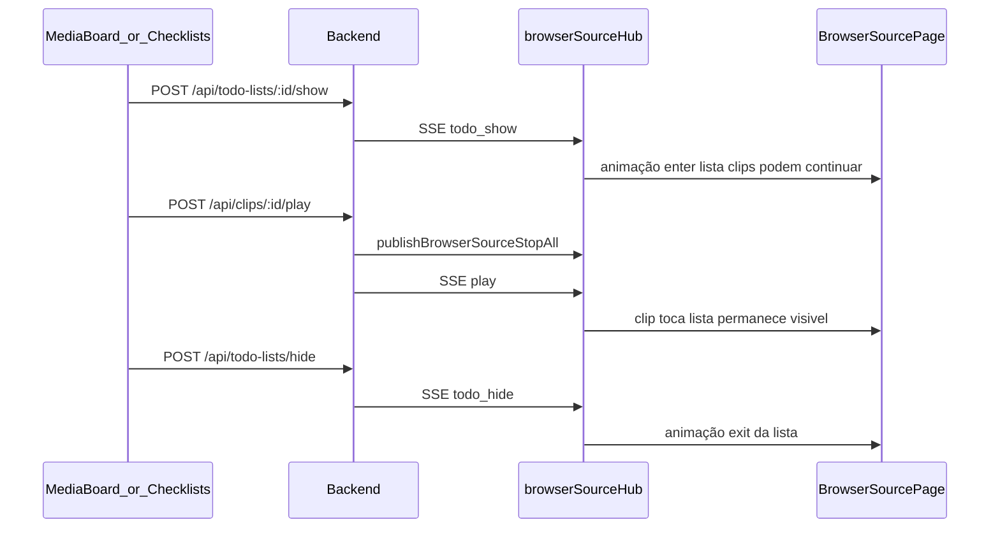
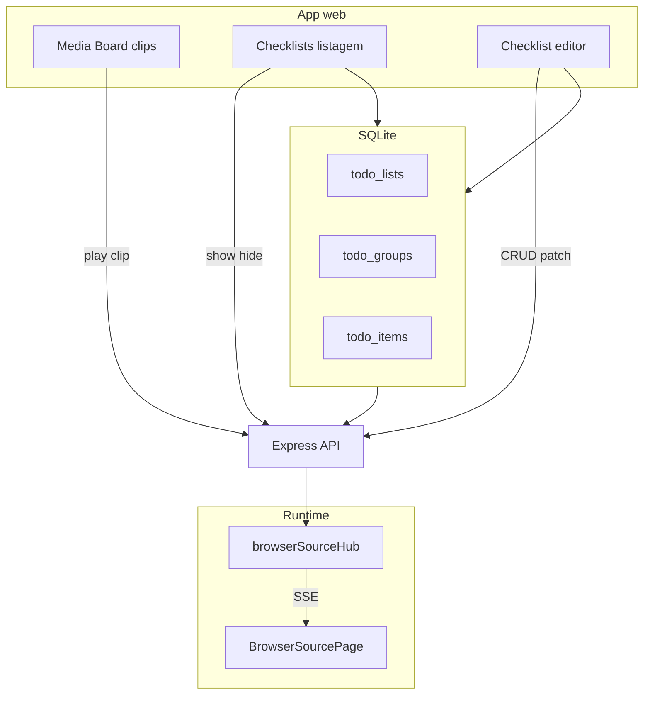
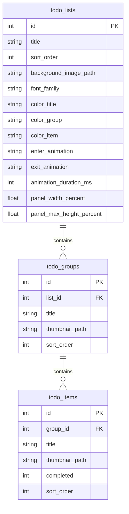

# Todo Lists no Browser Overlay — Especificação Técnica

**Status:** **Draft** — feature planejada; não implementada no código atual.  
**Público:** implementadores e revisores.  
**Relacionados:** [browser-source-setup.md](./browser-source-setup.md) (workflow OBS), [overlay-layout-stage.md](./overlay-layout-stage.md) (stage e layout de vídeo), [technical-specification.md](./technical-specification.md) (visão geral do app).

---

## 1. Status e escopo

### 1.1 Status

Este documento descreve o desenho de **checklists** (listas to-do) cadastráveis no app web e exibidas na mesma página do browser overlay (`/overlay/browser`) usada por clips de vídeo e áudio. A spec incorpora decisões já tomadas em revisão (controle SSE, animações no cadastro, **persistência da lista até ocultar manualmente**, coexistência com mídia de clips, **Media Board** e **listagem de checklists separada**).

### 1.2 Decisões confirmadas

| Tópico | Decisão |
| --- | --- |
| **Controle no overlay** | Comandos em tempo real via **SSE** (ver [§6.0](#60-o-que-é-sse-server-sent-events)), disparados a partir da UI de **Checklists** (**Mostrar** / **Ocultar**). Animações de entrada e saída são **padrão da lista**, definidas no cadastro (tema). A UI **não** escolhe o efeito por clique. |
| **Persistência da lista** | A lista **permanece no overlay** até o usuário mandar tirar: `POST /api/todo-lists/hide` ou botão **Ocultar** na tela de Checklists. Eventos `stop`, `play` de clip no **Media Board** e troca de mídia **não** ocultam a lista. |
| **Coexistência com clips** | Lista e clips **podem aparecer juntos**: vídeo/áudio tocam na camada de mídia; a lista fica em `.todo-overlay` (z-index acima do vídeo no v1). `POST .../show` **não** chama `publishBrowserSourceStopAll()`. |
| **Item completo** | Texto **riscado** (`text-decoration: line-through`) na classe `.is-completed`; cores de título de item permanecem as mesmas (sem checkmark obrigatório no v1). |
| **Ocultar lista (somente explícito)** | Apenas `todo_hide` dispara a **animação de saída** (`exit_animation` guardada no cliente); remove DOM ao fim da transição. |
| **Tamanho do painel** | **Configurável no cadastro** por lista: largura e altura máxima do painel em % do stage (`panel_width_percent`, `panel_max_height_percent`). |
| **Fonte (`font_family`)** | Campo **livre** (qualquer string CSS); UI pode sugerir fontes comuns, sem whitelist obrigatória. |
| **`stop` e mídia de clips** | `stop` e novo `play` afetam **somente** vídeo/áudio (comportamento atual de clips). **Não** alteram `activeTodoListId` nem removem a lista do overlay. |
| **Estado de animação no cliente** | No `todo_show`, o overlay **guarda** `exit_animation` e `animation_duration_ms` (e demais tema) em memória; só `todo_hide` usa esse estado para saída — o payload de `todo_hide` **não** repete `exit_animation`. |
| **Nome da área principal** | A tela de clips (hoje “Dashboard” no menu) passa a chamar-se **Media Board** (`/`, [`DashboardPage.tsx`](../frontend/src/pages/DashboardPage.tsx)). |
| **Checklists no app** | **Listagem própria**, separada do Media Board: rota `/checklists`, item de menu **Checklists**, sem misturar cards de clips com listas. |

### 1.3 In scope (v1 proposto)

- CRUD de **listas** com título, **tema** (imagem de fundo, fonte, cores), animações enter/exit e duração.
- CRUD aninhado de **grupos** (título + thumbnail opcional) e **itens** (título + thumbnail opcional + `completed`).
- Exibição em [`frontend/src/pages/BrowserSourcePage.tsx`](../frontend/src/pages/BrowserSourcePage.tsx) como camada DOM sobre `.browser-source-stage`.
- Comandos **show** / **hide** via API + SSE.
- Marcar item como completo na **edição da checklist** (ou na listagem, se houver toggle rápido) e refletir no overlay quando a lista estiver visível (via evento `todo_sync`; ver [§6](#6-protocolo-sse)).
- Renomear no UI o rótulo **Dashboard** → **Media Board** (menu, títulos, textos de ajuda).
- Upload e serviço de thumbnails e fundo em `%APPDATA%/LocalSoundboardServer/media/` (paths validados no backend, como clips).

### 1.4 Out of scope (v1)

- Múltiplas listas visíveis ao mesmo tempo no overlay (ao mostrar outra lista, substitui a anterior via novo `todo_show`).
- Editor visual drag-and-drop de posição da lista no stage (v1: painel central com tamanho % configurável, sem arrastar no canvas).
- Escolha de animação por ação na UI (apenas padrões salvos na lista).
- Cadastro de checklists dentro do Media Board (fica só em `/checklists`).
- Autenticação ou multi-usuário.
- Exibição de todo em fontes OBS legacy `?mode=landscape` / `?mode=portrait` (ver [§1.5](#15-modos-do-browser-source)).

### 1.5 Modos do browser source

| Modo | Recebe eventos `todo_*` |
| --- | --- |
| `stage` | Sim (recomendado: canvas em resolução do stream) |
| `universal` | Sim |
| `audio` | Não (somente áudio de clips) |
| `landscape`, `portrait` | Não no v1 (evita UI duplicada em várias fontes OBS) |

O streamer deve usar **`?mode=stage`** (ou `universal`) para listas e vídeo posicionado por layout areas. Ver [browser-source-setup.md](./browser-source-setup.md).

---

## 2. Problem statement

### 2.1 Comportamento atual

| Camada | Comportamento |
| --- | --- |
| **Overlay** | Apenas `<video>` e `<audio>`; eventos SSE `play` e `stop`. Fade de vídeo ~400 ms em CSS. |
| **Hub SSE** | [`backend/src/services/browserSourceHub.ts`](../backend/src/services/browserSourceHub.ts): união `BrowserSourcePlayEvent \| BrowserSourceStopEvent`. |
| **Media Board** (`/`) | Play de clips; sem entidade checklist persistida. |
| **Banco** | Tabelas `clips`, `categories`, `layout_areas`, `app_settings` — sem listas to-do. |

### 2.2 Comportamento alvo

| Camada | Comportamento |
| --- | --- |
| **Cadastro** | Página de admin para criar listas, grupos, itens e tema (fundo, fonte, cores, animações). |
| **Checklists** (`/checklists`) | Listagem separada; **Mostrar** / **Ocultar**; editor de lista/grupos/itens; toggle de `completed`. |
| **API** | REST `/api/todo-lists` + `POST .../show` e `POST .../hide`. |
| **SSE** | Novos tipos `todo_show`, `todo_hide`, `todo_sync` (além de `play` / `stop`). |
| **Overlay** | Camada `.todo-overlay` persistente até ocultar manualmente; animações enter/exit; clips na camada de mídia abaixo (z-index). |

### 2.3 Fluxo de dados (alvo)





---

## 3. Conceitos

| Conceito | Definição |
| --- | --- |
| **Lista (Todo list)** | Entidade raiz com título, tema visual, animações padrão e coleção ordenada de grupos. |
| **Grupo** | Seção dentro da lista com título e thumbnail opcional; agrupa itens (equivalente a “menu” na UI). |
| **Item** | Entrada checkável com título e thumbnail opcional; estado `completed` persistido. |
| **Tema** | Conjunto de aparência da lista no overlay: imagem de fundo, `font-family`, cores de título / grupos / itens. |
| **Animação enter** | Efeito ao **mostrar** a lista (`todo_show`). |
| **Animação exit** | Efeito ao **ocultar** a lista (`todo_hide`). |
| **Snapshot** | Payload completo da lista enviado no SSE para o overlay renderizar sem fetch extra no momento do show. |
| **Lista ativa** | No máximo uma lista visível no hub por instância do servidor (`activeTodoListId`). |
| **Media Board** | Área principal do app para **clips** (play ao vivo, busca, categorias). Rota `/`. Nome exibido no menu: **Media Board** (substitui “Dashboard”). Implementação atual: `DashboardPage.tsx`. |
| **Checklists** | Área separada para **listas to-do** do overlay. Rotas `/checklists`, `/checklists/new`, `/checklists/:id`. Não compartilha a grade de cards do Media Board. API REST permanece `/api/todo-lists` (termo técnico interno). |

### 3.1 Navegação do app (v1 proposto)

| Rota | Menu (`AppSideMenu`) | Página | Função |
| --- | --- | --- | --- |
| `/` | **Media Board** | `DashboardPage` (rótulo UI atualizado) | Clips |
| `/checklists` | **Checklists** | `ChecklistsListPage` (novo) | Listagem de checklists |
| `/checklists/new` | — | `ChecklistEditorPage` (novo) | Criar checklist |
| `/checklists/:id` | — | `ChecklistEditorPage` | Editar checklist |
| `/settings/layout-areas` | Layout areas | `LayoutAreasPage` | Layout do stage (inalterado) |
| `/clips/new` | New clip | `ClipFormPage` | Novo clip (inalterado) |

**Settings** não agrupa checklists no v1: `/settings/todo-lists` **não** será usado.

---

## 4. Modelo de dados

### 4.1 Hierarquia lógica

```text
TodoList
  ├── title
  ├── theme (background, font, colors, panel_width_percent, panel_max_height_percent)
  ├── enter_animation, exit_animation, animation_duration_ms
  └── groups[] (sort_order)
        ├── title, thumbnail?
        └── items[] (sort_order)
              ├── title, thumbnail?, completed
```

### 4.2 ERD



### 4.3 Tabelas SQLite (proposta)

Migrar em [`backend/src/db/migrate.ts`](../backend/src/db/migrate.ts) e documentar em [`backend/src/db/schema.sql`](../backend/src/db/schema.sql).

```sql
CREATE TABLE IF NOT EXISTS todo_lists (
    id INTEGER PRIMARY KEY AUTOINCREMENT,
    title TEXT NOT NULL,
    sort_order INTEGER NOT NULL DEFAULT 0,
    background_image_path TEXT,
    font_family TEXT NOT NULL DEFAULT 'system-ui, sans-serif',
    color_title TEXT NOT NULL DEFAULT '#ffffff',
    color_group TEXT NOT NULL DEFAULT '#e2e8f0',
    color_item TEXT NOT NULL DEFAULT '#f8fafc',
    enter_animation TEXT NOT NULL DEFAULT 'fade'
        CHECK (enter_animation IN ('fade', 'slide_top', 'slide_bottom', 'slide_left', 'slide_right')),
    exit_animation TEXT NOT NULL DEFAULT 'fade'
        CHECK (exit_animation IN ('fade', 'slide_top', 'slide_bottom', 'slide_left', 'slide_right')),
    animation_duration_ms INTEGER NOT NULL DEFAULT 400,
    panel_width_percent REAL NOT NULL DEFAULT 80
        CHECK (panel_width_percent > 0 AND panel_width_percent <= 100),
    panel_max_height_percent REAL NOT NULL DEFAULT 90
        CHECK (panel_max_height_percent > 0 AND panel_max_height_percent <= 100),
    created_at TIMESTAMP DEFAULT CURRENT_TIMESTAMP,
    updated_at TIMESTAMP DEFAULT CURRENT_TIMESTAMP
);

CREATE TABLE IF NOT EXISTS todo_groups (
    id INTEGER PRIMARY KEY AUTOINCREMENT,
    list_id INTEGER NOT NULL REFERENCES todo_lists(id) ON DELETE CASCADE,
    title TEXT NOT NULL,
    thumbnail_path TEXT,
    sort_order INTEGER NOT NULL DEFAULT 0
);

CREATE TABLE IF NOT EXISTS todo_items (
    id INTEGER PRIMARY KEY AUTOINCREMENT,
    group_id INTEGER NOT NULL REFERENCES todo_groups(id) ON DELETE CASCADE,
    title TEXT NOT NULL,
    thumbnail_path TEXT,
    completed INTEGER NOT NULL DEFAULT 0,
    sort_order INTEGER NOT NULL DEFAULT 0
);
```

### 4.4 Semântica dos campos

| Campo | Notas |
| --- | --- |
| `color_*` | String CSS (`#RRGGBB`, `rgb()`, etc.); validar no backend. |
| `font_family` | String **livre** (CSS); sugestões opcionais no UI; overlay tenta carregar Google Fonts se o nome não for system stack. |
| `enter_animation` / `exit_animation` | Independentes (ex.: enter `slide_left`, exit `fade`). |
| `animation_duration_ms` | Default **400** (alinhado a `FADE_MS` em `BrowserSourcePage`). |
| `panel_width_percent` | Largura máxima do `.todo-panel` em % da largura do stage (default **80**). |
| `panel_max_height_percent` | Altura máxima do painel em % da altura do stage; conteúdo excedente com scroll interno (default **90**). |
| `thumbnail_path` | Arquivo relativo sob `media/todo-thumbnails/`. |
| `background_image_path` | Sob `media/todo-backgrounds/`; limite de upload sugerido **2 MB**. |
| Thumbnails grupo/item | Limite sugerido **1 MB** (consistente com clips). |

### 4.5 Arquivos de mídia

```text
%APPDATA%/LocalSoundboardServer/media/
  todo-backgrounds/
    {listId}.{ext}
  todo-thumbnails/
    group-{id}.{ext}
    item-{id}.{ext}
```

Paths devem permanecer sob o diretório de mídia do app (mesma regra de segurança dos clips).

---

## 5. Referência de API REST

Router proposto: `/api/todo-lists`, registrado em [`backend/src/app.ts`](../backend/src/app.ts). Repositório: `backend/src/db/repositories/todoLists.ts`. Rotas: `backend/src/routes/todoLists.ts`.

### 5.1 Listas

| Método | Rota | Descrição |
| --- | --- | --- |
| `GET` | `/api/todo-lists` | Resumo: `id`, `title`, `sort_order` |
| `POST` | `/api/todo-lists` | Cria lista (JSON) |
| `GET` | `/api/todo-lists/:id` | Árvore completa + URLs de mídia resolvidas |
| `PUT` | `/api/todo-lists/:id` | Atualiza metadados, tema, animações |
| `DELETE` | `/api/todo-lists/:id` | Remove lista, grupos, itens e arquivos associados |

### 5.2 Grupos e itens

| Método | Rota | Descrição |
| --- | --- | --- |
| `POST` | `/api/todo-lists/:id/groups` | Cria grupo |
| `PUT` | `/api/todo-lists/:listId/groups/:groupId` | Atualiza grupo (multipart opcional para thumb) |
| `DELETE` | `/api/todo-lists/:listId/groups/:groupId` | Remove grupo e itens (CASCADE) |
| `POST` | `/api/todo-lists/:listId/groups/:groupId/items` | Cria item |
| `PATCH` | `/api/todo-lists/:listId/items/:itemId` | Atualiza título, thumb, `completed` |
| `DELETE` | `/api/todo-lists/:listId/items/:itemId` | Remove item |

### 5.3 Overlay e mídia

| Método | Rota | Descrição |
| --- | --- | --- |
| `POST` | `/api/todo-lists/:id/show` | `todo_show` com snapshot (**sem** `publishBrowserSourceStopAll()`; clips podem continuar) |
| `POST` | `/api/todo-lists/hide` | `todo_hide` se houver lista ativa |
| `GET` | `/api/todo-lists/:id/background` | Serve imagem de fundo |
| `GET` | `/api/todo-lists/thumbnails/:entityId` | Serve thumb de grupo ou item (`?kind=group\|item`) |

### 5.4 Estado da lista ativa

- Variável em memória no hub: `activeTodoListId: number | null`.
- `show` define o id; **somente** `hide` limpa `activeTodoListId`. `stop` / `play` de clip não alteram esse estado.
- Estender `GET /api/browser-source/status` com `active_todo_list_id` (opcional v1) para a listagem/edição de Checklists exibir indicador “no ar”.

### 5.5 Exemplo de resposta `GET /api/todo-lists/:id`

```json
{
  "id": 1,
  "title": "Roteiro da live",
  "sort_order": 10,
  "theme": {
    "background_url": "/api/todo-lists/1/background",
    "font_family": "Oswald, system-ui, sans-serif",
    "color_title": "#ffffff",
    "color_group": "#94a3b8",
    "color_item": "#f1f5f9"
  },
  "enter_animation": "slide_bottom",
  "exit_animation": "fade",
  "animation_duration_ms": 400,
  "panel_width_percent": 80,
  "panel_max_height_percent": 90,
  "groups": [
    {
      "id": 10,
      "title": "Abertura",
      "sort_order": 0,
      "thumbnail_url": "/api/todo-lists/thumbnails/10?kind=group",
      "items": [
        {
          "id": 100,
          "title": "Introduzir canal",
          "sort_order": 0,
          "completed": false,
          "thumbnail_url": null
        }
      ]
    }
  ]
}
```

### 5.6 DTO do overlay (`TodoListOverlayDto`)

Mesma forma do `GET :id`, usada no payload SSE `todo_show` / `todo_sync` (URLs absolutas ou path-relative resolvido no cliente com `window.location.origin`).

---

## 6. Protocolo SSE

### 6.0 O que é SSE (Server-Sent Events)?

**SSE** é um canal do servidor para o navegador: a página do overlay (OBS) abre uma conexão longa em `GET /api/browser-source/events?mode=...` e o backend **empurra** mensagens JSON quando algo acontece no app — por exemplo “tocar este clip” no **Media Board** (`play`) ou “mostrar esta checklist” na área **Checklists** (`todo_show`).

```text
App (PC) Media Board / Checklists   Backend                         Overlay (OBS Browser)
     |                               |                                    |
     |-- POST /api/todo-lists/1/show ->|  (desde /checklists)               |
     |                               |-- SSE data: {"type":"todo_show"} -->|
     |                               |                                    | lista aparece
```

Não é WebSocket: é **unidirecional** (servidor → overlay). O overlay não envia comandos de volta por essa conexão; o **Media Board** e **Checklists** usam REST (`POST`) para disparar ações.

Hoje os clips já usam SSE com `play` e `stop`. As listas to-do acrescentam `todo_show`, `todo_hide` e `todo_sync` no mesmo fluxo. Ver [browser-source-setup.md](./browser-source-setup.md).

### 6.1 Extensão da união de eventos

Em [`browserSourceHub.ts`](../backend/src/services/browserSourceHub.ts):

```ts
interface BrowserSourceTodoShowEvent {
  type: 'todo_show';
  list: TodoListOverlayDto;
}

interface BrowserSourceTodoHideEvent {
  type: 'todo_hide';
  // Sem exit_animation no payload: o overlay usa o estado guardado no último todo_show.
}

interface BrowserSourceTodoSyncEvent {
  type: 'todo_sync';
  list: TodoListOverlayDto;
}

type BrowserSourceSseEvent =
  | BrowserSourcePlayEvent
  | BrowserSourceStopEvent
  | BrowserSourceTodoShowEvent
  | BrowserSourceTodoHideEvent
  | BrowserSourceTodoSyncEvent;
```

Publicadores sugeridos:

- `publishBrowserSourceTodoShow(event)`
- `publishBrowserSourceTodoHide(event?)`
- `publishBrowserSourceTodoSync(event)`

### 6.2 Filtro por modo

```ts
function browserSourceModeAcceptsTodo(mode: BrowserSourceMode): boolean {
  return mode === 'stage' || mode === 'universal';
}
```

Clientes que não aceitam todo ignoram eventos `todo_*` sem erro.

### 6.3 Estado guardado no overlay (cliente)

Após cada `todo_show` / `todo_sync`, o overlay mantém em memória (refs React):

| Campo guardado | Uso |
| --- | --- |
| `exit_animation` | Somente em `todo_hide` (ocultar manual) |
| `animation_duration_ms` | Duração das transições enter e exit |
| `enter_animation` | Próximo `todo_show` (re-show) |
| Snapshot da lista | Render e reconciliação em `todo_sync` |

`todo_hide` envia apenas `{ type: 'todo_hide' }`.

### 6.4 Regras de persistência e coexistência

| Evento | Overlay |
| --- | --- |
| `stop` | Para vídeo/áudio **imediatamente**. **Não** altera a lista to-do (permanece visível se já estava). |
| `play` | Precedido de `stop` no servidor para trocar mídia de clip; **lista permanece** visível. Vídeo/áudio renderizam na camada de mídia; `.todo-overlay` mantém z-index superior no v1. |
| `todo_show` | Monta ou substitui DOM da lista; guarda tema/animções; animação **enter**. **Não** para clips em reprodução. |
| `todo_hide` | Único evento que oculta a lista: animação **exit**; remove DOM ao fim; servidor limpa `activeTodoListId`. |
| `todo_sync` | Atualiza snapshot e DOM (ex.: `completed` / riscado); sem re-enter. |

`PATCH` em item com lista ativa → backend chama `publishBrowserSourceTodoSync` com snapshot atualizado. Evita hide+show (pisca na transmissão).

**Mostrar outra lista** com uma já ativa: novo `todo_show` substitui conteúdo (exit enter da nova lista ou cross-fade — v1 pode trocar snapshot e re-enter; detalhe de implementação).

**Z-index (v1):** `.todo-overlay` acima de `.browser-source-video-slot` e `<audio>` (lista sempre legível por cima do vídeo). Se no futuro a lista deve ficar atrás do vídeo, tornar configurável.

### 6.5 Reconnect SSE

Ao `subscribe`, se `activeTodoListSnapshot` estiver definido no hub, o servidor envia imediatamente um `todo_show` **apenas para o cliente recém-conectado** (desde que o mode aceite todo). Implementado via `activeTodoListSnapshot` atualizado em `todo_show`, `todo_sync` e limpo em `todo_hide`.

---

## 7. Catálogo de animações

Valores persistidos em `todo_lists.enter_animation` e `exit_animation`:

| ID | Enter (aparecer) | Exit (sumir) |
| --- | --- | --- |
| `fade` | `opacity` 0 → 1 | `opacity` 1 → 0 |
| `slide_top` | `translateY(-100%)` → 0 (+ fade opcional) | 0 → `-100%` |
| `slide_bottom` | `translateY(100%)` → 0 | 0 → `100%` |
| `slide_left` | `translateX(-100%)` → 0 | 0 → `-100%` |
| `slide_right` | `translateX(100%)` → 0 | 0 → `100%` |

Enter e exit são **independentes**. Uma única `animation_duration_ms` aplica-se a ambos.

### 7.1 Implementação CSS (overlay)

- Container: `.todo-overlay` (`position: absolute; inset: 0; pointer-events: none`).
- Painel: `.todo-panel` com CSS variables do tema.
- Estados: `.is-entering` → `.is-visible` → `.is-exiting`.
- Preferir **CSS transitions** em `opacity` e `transform`, com `transitionend` + timeout fallback (`duration + 50 ms`), mesmo padrão do vídeo em `BrowserSourcePage`.
- Variável sugerida: `--todo-animation-duration` espelhando `animation_duration_ms`.

### 7.2 Mapeamento animação → classes

| ID | Classes/data-attr sugeridos |
| --- | --- |
| `fade` | `[data-todo-anim="fade"]` |
| `slide_*` | `[data-todo-anim="slide"][data-todo-dir="top\|bottom\|left\|right"]` |

---

## 8. UI do overlay e tema

### 8.1 Estrutura DOM

```text
.browser-source-stage
  ├── audio (existente, z-index baixo)
  ├── .browser-source-video-slot (existente, z-index médio)
  └── .todo-overlay (z-index alto — persiste até todo_hide)
        └── .todo-panel
              ├── .todo-title
              └── .todo-group × N
                    ├── .todo-group-header (img + h3)
                    └── .todo-item × M (img + span + .is-completed)
```

Implementação sugerida: componente `TodoOverlayLayer.tsx` importado por `BrowserSourcePage`.

### 8.2 CSS variables (tema)

| Token | Uso |
| --- | --- |
| `--todo-bg-image` | `background-image` no `.todo-panel` |
| `--todo-font-family` | Título, grupos, itens |
| `--todo-color-title` | `.todo-title` |
| `--todo-color-group` | Cabeçalhos de grupo |
| `--todo-color-item` | Texto dos itens |
| `--todo-panel-width` | `panel_width_percent` → `max-width` do painel |
| `--todo-panel-max-height` | `panel_max_height_percent` → `max-height` + `overflow-y: auto` |
| `--todo-animation-duration` | Transições enter/exit |

### 8.3 Layout do painel

- `.todo-overlay`: full stage (`inset: 0`), flex ou grid para centralizar o painel.
- `.todo-panel`: largura e altura máximas via `--todo-panel-width` e `--todo-panel-max-height` (valores vindos do cadastro, defaults 80% × 90%).
- Cadastro: controles numéricos ou sliders para `panel_width_percent` e `panel_max_height_percent` (intervalo sugerido **20–100**).
- Preview no editor de Checklists usa os mesmos percentuais.

### 8.4 Fontes

- `font_family` **livre** (texto digitado ou colado, ex. `Bebas Neue`, `Inter, sans-serif`).
- Overlay: se a família não for system stack, tentar `<link>` Google Fonts com o primeiro nome da família; fallback `system-ui, sans-serif`.
- Validação backend: tamanho máximo da string e caracteres seguros (evitar injeção em HTML).

### 8.5 Item completo (visual)

- Classe `.is-completed` no `.todo-item`.
- Título do item: `text-decoration: line-through` (riscado).
- Cor do texto: mesma `--todo-color-item` (sem estilo extra obrigatório no v1).

---

## 9. UI do app: Media Board e Checklists

### 9.1 Media Board (renomear Dashboard)

- Menu lateral: rótulo **Media Board** em vez de **Dashboard** ([`AppSideMenu.tsx`](../frontend/src/components/AppSideMenu.tsx)).
- Rota permanece `/`; página pode manter o nome de arquivo `DashboardPage.tsx` no v1 (refactor de componente opcional depois).
- Textos de ajuda que citam “dashboard” passam a “Media Board” (form de clip, layout areas, toasts).
- **Sem** cards ou atalhos de checklists nesta tela — só clips.

### 9.2 Checklists — listagem separada

Nova página de **listagem**, inspirada na estrutura de lista de [`LayoutAreasPage.tsx`](../frontend/src/pages/LayoutAreasPage.tsx) (tabela/cards simples, não a grade do Media Board).

| Item | Valor |
| --- | --- |
| Rota listagem | `/checklists` |
| Menu | **Checklists** (item próprio, entre Media Board e Layout areas) |
| Página | `ChecklistsListPage.tsx` (novo) |

**Conteúdo da listagem:**

- Título da página: **Checklists**
- Botão **Nova checklist**
- Lista ordenada (`sort_order`): título, indicador **no ar** se `active_todo_list_id` coincidir
- Por linha/card: **Editar**, **Mostrar no overlay**, **Ocultar** (Ocultar desabilitado se não estiver no ar), **Excluir** (modal de confirmação)
- Clique no título ou **Editar** → `/checklists/:id`

### 9.3 Checklists — editor

| Item | Valor |
| --- | --- |
| Rotas | `/checklists/new`, `/checklists/:id` |
| Página | `ChecklistEditorPage.tsx` (novo) |

**Seções do editor (abas ou blocos):**

1. **Geral** — título da lista, ordem.
2. **Tema** — upload de fundo, fonte livre, color pickers (título, grupos, itens), **largura/altura % do painel**, preview ao vivo com as mesmas CSS variables do overlay.
3. **Grupos e itens** — árvore editável; upload de thumbs; setas para `sort_order`; toggle `completed` nos itens (preview com texto riscado).
4. **Animações** — selects enter/exit, duração em ms, preview opcional (mock CSS).

**Barra de ações fixa no editor:** **Mostrar no overlay**, **Ocultar**, link **Voltar à listagem** (`/checklists`).

### 9.4 Rotas em `App.tsx` (proposta)

```tsx
<Route path="/checklists" element={<ChecklistsListPage />} />
<Route path="/checklists/new" element={<ChecklistEditorPage mode="create" />} />
<Route path="/checklists/:id" element={<ChecklistEditorPage mode="edit" />} />
```

### 9.5 Menu lateral (proposta)

```ts
const NAV_ITEMS = [
  { to: '/', label: 'Media Board', end: true },
  { to: '/checklists', label: 'Checklists', end: false },
  { to: '/settings/layout-areas', label: 'Layout areas', end: false },
  { to: '/clips/new', label: 'New clip', end: false },
] as const;
```

### 9.6 Wireframes (ASCII)

**Listagem (`/checklists`):**

```text
+------------------------------------------------------------------+
|  Checklists                              [ + Nova checklist ]    |
+------------------------------------------------------------------+
|  Roteiro da live          (no ar)   [ Mostrar ] [ Ocultar ] [Editar] [Excluir]
|  Próximos jogos                     [ Mostrar ] [ Ocultar ] [Editar] [Excluir]
|  Patrocínios                        [ Mostrar ] [ Ocultar ] [Editar] [Excluir]
+------------------------------------------------------------------+
```

**Editor (`/checklists/:id`):**

```text
+------------------------------------------------------------------+
|  ← Checklists    Roteiro da live     [ Mostrar ] [ Ocultar ]     |
+------------------------------------------------------------------+
| [ Geral ] [ Tema ] [ Grupos ] [ Animações ]                      |
|  ... editor + preview ...                                          |
+------------------------------------------------------------------+
```

### 9.7 Cliente HTTP

Tipos e métodos em [`frontend/src/lib/api.ts`](../frontend/src/lib/api.ts); tipos compartilhados de overlay em `frontend/src/lib/todoOverlay.ts` (proposto).

---

## 10. Fases de implementação

| Fase | Entregável |
| --- | --- |
| **A** | Schema SQLite, repositório, CRUD REST, servir mídia, deletes com limpeza de arquivos |
| **B** | Hub SSE (`todo_show`, `todo_hide`, `todo_sync`), `show`/`hide`, persistência (clips não ocultam lista), filtro por mode |
| **C** | `TodoOverlayLayer` + CSS + animações; integração em `BrowserSourcePage` |
| **D** | `ChecklistsListPage` + `ChecklistEditorPage`; menu Media Board + Checklists; tema/preview; status `active_todo_list_id` |
| **E (v1.1)** | Aviso de contraste no preview |

### 10.1 Arquivos previstos

| Camada | Arquivos |
| --- | --- |
| DB | `migrate.ts`, `schema.sql`, `repositories/todoLists.ts` |
| API | `routes/todoLists.ts`, `app.ts` |
| SSE | `browserSourceHub.ts`, `routes/browserSource.ts` (status) |
| Frontend API | `lib/api.ts`, `lib/todoOverlay.ts` |
| Overlay | `BrowserSourcePage.tsx`, `components/TodoOverlayLayer.tsx`, `index.css` |
| Admin | `pages/ChecklistsListPage.tsx`, `pages/ChecklistEditorPage.tsx`, `App.tsx`, `AppSideMenu.tsx`; rótulos Media Board em `DashboardPage` / textos |

---

## 11. Decisões de produto (registro)

| # | Tópico | Decisão (2026-06-04) |
| --- | --- | --- |
| 1 | Item completo | **Riscado** (`line-through`) |
| 2 | Ocultar lista | **Somente** botão Ocultar / `todo_hide` (animação exit); `stop` e `play` **não** ocultam |
| 3 | SSE | Explicado em [§6.0](#60-o-que-é-sse-server-sent-events) |
| 4 | Tamanho do painel | **Configurável** (`panel_width_percent`, `panel_max_height_percent`) |
| 5 | Fontes | **Livre** (string CSS) |
| 6 | `stop` e mídia | **`stop` limpa só mídia** de clip; lista ativa permanece até `hide` |
| 7 | `todo_hide` | Overlay **guarda** `exit_animation` após `todo_show`; payload de hide sem repetir |
| 8 | Persistência | Lista **só sai** com Ocultar explícito; `play`/`stop` de clip não removem |
| 9 | Nome UI principal | **Media Board** (substitui Dashboard no menu) |
| 10 | Checklists no app | **Listagem separada** em `/checklists`, fora do Media Board |

### 11.1 Resolvido em implementação

| Tópico | Status |
| --- | --- |
| **Reconnect SSE** | Ao reconectar, clientes `stage`/`universal` recebem `todo_show` com o snapshot ativo (`activeTodoListSnapshot` no hub). |

### 11.2 Ainda em aberto

| Tópico | Notas |
| --- | --- |
| **Contraste no preview** | Heurística opcional fundo vs cor do título no cadastro. |

---

## 12. Documentos relacionados

- [browser-source-setup.md](./browser-source-setup.md) — URLs `?mode=`, SSE de clips, setup OBS.
- [overlay-layout-stage.md](./overlay-layout-stage.md) — stage, layout areas e posicionamento de vídeo no mesmo overlay.
- [technical-specification.md](./technical-specification.md) — stack, dados locais, API v1 existente.

**Changelog desta spec**

| Data | Nota |
| --- | --- |
| 2026-06-04 | Rascunho inicial; decisões SSE + animações no cadastro; exclusividade com clips. |
| 2026-06-04 | Revisão de produto: riscado, exit animado, painel % configurável, fonte livre, stop limpa tudo, cliente guarda exit_animation; §6.0 explica SSE. |
| 2026-06-04 | Persistência: lista só sai com Ocultar explícito; coexistência com clips; show não dá stop. |
| 2026-06-04 | Media Board + Checklists em `/checklists` (listagem e editor separados do Media Board). |
| 2026-06-05 | Upload de fundo/thumbnails; reconnect SSE com re-show; reordenação de grupos/itens; textos Media Board. |
